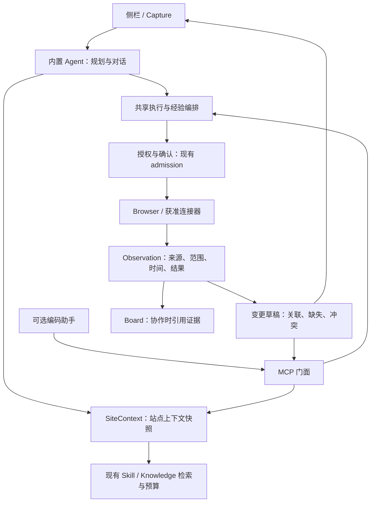

# CMspark 0.7.0 深入审计：企业跨系统工作助手

GitHub: [#445](https://github.com/nehcuh/cmspark/issues/445)
基线：`63b449d9ff77c2c37af54579fbff3b628df286c1`，Companion / Extension `0.6.6`
日期：2026-09-07；状态：分析完成，升级范围建议；**不是 0.7.0 发布批准**。
实施建议：[0.7.0 升级规划](../superpowers/plans/2026-09-07-cmspark-0.7.0-upgrade.md)

## 1. 结论与决策背景

用户补充的企业约束改变了评估基准：企业用户可能无法使用 Codex 等电脑助手；内部系统主要是网页，业务人员必须跨 DevOps、制品库、架构平台、CMDB 等系统手工拼接信息。CMspark 必须能独立工作；允许使用外部编码助手的环境，MCP 是可选入口。

**0.7.0 应交付一个可核对的企业跨系统材料闭环，而不是增加一批通用助手功能。** 建议首个闭环为“变更申请材料准备”，输出可追溯草稿、缺失项与冲突项。研发需求—代码—缺陷—测试关联作为第二验证场景，验证共享能力能否复用；不把自动写入多个平台、自动编码、无人值守全部捆进首发。

现状判断：

1. 浏览器执行、授权、知识检索、Pack、任务状态与安装包均有真实实现，不是演示壳。
2. 企业任务缺少的是跨站上下文刷新、提取范围与完整性、实体关联、业务证据及结果核验。
3. 内置 Agent 与 MCP 共享底层执行入口，但没有完整共享站点知识和经验生命周期。
4. 应渐进抽取共享服务；保留现有 Extension + Companion 拓扑与单一内置 tool-loop。
5. 当前不能直接升级版本号并宣称 0.7.0 就绪：存在已复现缺陷、测试隔离问题及尚无真实试点证据的业务能力。

这里的“企业”指用户的使用环境，**不等于现有 `capability_profile=enterprise` 必须开启**。变更材料读取应尽量保持 L1，无需为了企业场景打开 shell、netsec 或完整自主巡航。

## 2. 方法、范围与证据等级

本次进行了产品/ADR/规划/Issue 对账，三路独立只读评审（架构、正确性/证据、安全/交付），主审逐条回读关键代码，并运行类型检查、测试、知识路由评测和非破坏性探针。

证据标签：

- **R：复现**——实际生产函数或源码方法在隔离/模拟输入下运行；不等于真实企业页面复现。
- **S：源码确认**——调用链和条件明确；尚无动态现场证明。
- **D：设计限制**——实现符合现有较窄契约，但不能支持更强产品承诺。
- **U：未验证**——需要企业样本、目标模型或安装环境。
- **P：建议**——0.7.0 候选设计，尚未实现。

范围覆盖核心浏览器、上下文、知识、Pack、Board、Loop、MCP、权限、模型接入、测试和打包链。语音、视觉定位、宿主适配、终端按其与首场景的依赖关系评估，未进行每个平台的实机重验。

没有访问真实企业页面、提交业务表单、调用模型 API、安装替换应用、修改版本或提交代码。用户提供的真实系统样本、试点 OS 与企业模型尚未到位；不能把本报告描述成业务验收。现有未跟踪目录 `.agents/`、`.codex/` 及两个 scratch 文件未改动。

**测试副作用披露：**普通 `npm test` 执行到现有 `computer-executor.test.ts:1496` 的全局 `saveConfig()`，该测试在 `finally` 恢复原 security；此测试当次通过。随后全部重验显式隔离数据目录。没有运行前配置快照，无法证明不存在其他并发配置变化，不能声称本轮完全未触碰用户配置。该发现列为 F01，未擅自根据猜测回写配置。

## 3. 本轮机器结果

运行机：macOS，Node `22.23.2`。表中的测试数字是 Node runner 输出，包含嵌套测试，不能解释为独立业务场景数量。

| 检查 | 本轮结果 | 解释 |
|---|---|---|
| 当前 HEAD GitHub CI | success | [原始运行](https://github.com/nehcuh/cmspark/actions/runs/34067823301)；不能替代本机与安装包验收 |
| Companion `npm test`，普通环境 | exit 1；4917 tests，4878 pass，16 fail，23 skip | 主批次失败，因此串行 settings-web 批次未执行 |
| 同 3 个 CU 文件，空临时数据目录 | exit 0；144 tests，143 pass，0 fail，1 skip | 16 项失败全部消失 |
| 同 3 个 CU 文件，临时目录仅配置巡航三旗 | exit 1；144 tests，127 pass，16 fail，1 skip | 确认配置依赖，不是 16 个独立产品故障 |
| Companion 编译产物全套 runner，显式临时数据目录 | exit 1；4917 tests，4890 pass，4 fail，23 skip | 另外 4 项测试与自定义 DATA_DIR 的路径约定冲突；settings-web 串行批次仍未执行 |
| Extension `npm test` | exit 0；1250 pass，0 fail，0 skip | 含 hygiene 检查、测试编译 |
| Companion / Extension `tsc --noEmit` | 两者 exit 0 | 不构建或安装最终产物 |
| `knowledge-route-eval.mjs --strict` | exit 0；folder pass / group pass | 20 文档 × 20 query 的构造路由算例；不是企业检索评测 |
| 只读正确性探针 | 四类行为复现 | [脚本](0.7.0-20260907/probes.cjs)、[结果](0.7.0-20260907/probe-results.json) |

原始测试日志保存在本机 `/tmp/cmspark-070-*.log`，不上传完整日志；持久化摘要：[evidence.json](0.7.0-20260907/evidence.json)。本轮**没有获得 Companion 完整套件全绿结果**；不能用分组通过拼成整体通过。

## 4. 需求实现与业务适用性矩阵

“已有”仅指代码/测试链路存在，并非全量真实场景验证。没有固定需求总分母，不能给可信的总体完成百分比。

| 能力 | 当前实现/证据 | 对 0.7.0 的作用与缺口 |
|---|---|---|
| 独立 Agent | `llm/adapter.ts`、`llm/provider.ts` | 必须保留；目标企业模型的工具调用、压缩、取消、错误恢复需试点 |
| 已登录浏览器操作 | `background/browser-bridge.ts`、`server.ts` | 核心执行资产；需范围一致性和页面覆盖状态 |
| 文本/HTML 提取 | 顶层 innerText / outerHTML；HTML 500000 字符上限 | 有基础，未提供稳定 frame/pagination/virtual-list 覆盖契约 |
| 文本/CSS 定位与错误分类 | `resolveLocator`、`failInteractive` | 复用；CSS 第一个匹配与文本歧义拒绝语义不同 |
| Capture/侧栏/确认台 | 多面已实现；`summoner-web.ts` 等 | 保留入口分工；首发无需再做一轮视觉大改 |
| 站点知识触发 | `site-matcher.ts`、`skill-engine.ts` | hostname 匹配存在；同轮跨站不会自动重装配 |
| 知识检索/来源/预算 | TF-IDF、固定选择、簇路由、retrieved_sources | 继续复用；来源文档命中不等于业务字段有证据 |
| 自动失败经验 | `tool/site-op-memory.ts`、adapter 持久化 | 机器停试有价值；键冲突、作用范围与失效需处理 |
| 知识图谱 | 派生相关度、小语料 LLM 覆盖层 | 辅助浏览；不是企业实体关系或事实验证系统 |
| Mission Pack | 配方/白名单/知识/提示/模块装配 | 合适的业务场景载体；不要升级成新 workflow runtime |
| 专家团队 | 七角色 Pack、调度/组队 | 是 persona 与工具配方；不等于已实现跨平台业务专家流程 |
| 运维专家 | `expert-ops/pack.yaml` 仅 list_tabs/get_page_text/screenshot/use_skill | 适合材料顾问；缺导航/查询能力的配方不能承诺自动跨站采集 |
| Board | Fact/Intent/Evidence/来源/服务器盖章/幂等 handback | 可复用类型与引用；tool_verified/完成语义需收窄解释 |
| RunProgress/Loop | 步骤、证据 tick、续跑、停止、预算、blocked | 工具执行进度；不能当业务结果状态 |
| Outbound MCP | grant、default/interact profile、双入口 tab lease、导出同意 | 执行可用；站点上下文与经验不共享，新增知识导出需独立边界 |
| Inbound MCP | 生命周期、协议适配、信任/能力确认 | 可接获准 API，非浏览器唯一依赖；目标系统无 API 时浏览器仍关键 |
| ACP/编程接力 | 任务包、会话、untrusted handback、diff apply | 第二场景可复用；不解决企业实体关联本身 |
| 内嵌终端 | #432 未关闭，PTY/前端/测试存在 | 保留现有实验状态，不作为变更草稿依赖 |
| 桌面 CU/Host | 多平台适配与安全/模型完整性链 | 可选兜底；不能因默认浏览器提取不足而要求全员启用 |
| 语音/会议 | 本地 STT、会议工作台等已实现 | 与首闭环弱耦合；维护兼容，不继续扩面 |
| 打包/升级 | runtime/sidecar、版本门、签名复验、WS 协商 | 实际内网/干净用户安装验收仍缺；不能以源码测试替代 |

## 5. 关键发现清单

P1/P2 是现有缺陷处理优先级；“0.7 核心缺口”是新版本需求差距，不伪装成已确认安全漏洞。

| ID | 类别/优先级 | 发现 | 0.7.0 处理 |
|---|---|---|---|
| F01 | R+S / P1 | 测试读写全局用户配置，执行器混合注入配置和全局实时配置 | 第一批修复；明确定义实时撤销与测试注入 |
| F02 | R / P2 | HTML scripting fallback 丢失 selector，返回范围扩大 | 第一批修复；主路径/两回退同范围 |
| F03 | R+S / P2 | 站点经验名称的点号替换造成不同 hostname 冲突 | 第一批修复；稳定 ID 与迁移 |
| F04 | S+D / 0.7 核心缺口 | 同轮跨站不刷新知识，MCP 绕开上下文/经验生命周期 | 抽共享上下文与执行经验服务 |
| F05 | R+D / 0.7 核心缺口 | Board tool_verified 只验工具 ID 存在 | 分开观察记录、字段绑定与业务验证 |
| F06 | R+D / 0.7 核心缺口 | RunProgress/Board 的完成不足以证明材料收齐 | 引入场景级完整性契约；保留旧完成状态的边界 |
| F07 | S+D / 0.7 核心缺口 | 提取结果缺 frame/分页/截断/终止原因的覆盖语义 | 先覆盖试点出现的结构，未覆盖必须明确 |
| F08 | S+D / P2 改善 | 失败经验无 TTL/页面版本；stale 不撤销已 hydrate 的 ban | 区分短期失败缓存与长期知识，提供复核/失效 |
| F09 | S+D / 0.7 核心缺口 | 缺企业实体对应、时间、来源级字段、冲突模型 | 建最小 Observation/Claim/Deliverable 契约 |
| F10 | S / 条件需求 | grant 无 per-site 字段；知识外发尚无专用授权契约 | 新知识出口最小授权必做；全站点 grant 按承诺决定 |
| F11 | S+U / 发布前置 | 本地持久化脱敏不等于模型出网脱敏；可选依赖需要下载 | 指定企业 endpoint/离线核心路径的包体验收 |
| F12 | S / 治理缺口 | 文档版本/冻结项与 Issue/代码不一致 | 建能力台账，明确 superseded 的具体条款 |
| F13 | S / 架构债 | 大路由/大设置组件、全局 _rt、知识/Skill 兼容混合 | 沿新业务链路渐进抽取，不全面搬目录 |

### F01：测试隔离与实时策略依赖

`ComputerExecutorDeps.config` 已注入（`computer/executor.ts:125`），但 re-L2 在 `:681` 读取全局 `getConfig().security`；无人值守 grant 也读全局模块（`:656`）。`computer-executor.test.ts:10` 等三个测试文件未在模块载入前隔离数据目录。

同一组 fake 执行器在空配置下 143 pass/1 skip，临时三旗下 127 pass/16 fail/1 skip。普通环境全量出现相同 16 fail。更重要的是 `computer-executor.test.ts:1496–1530` 调用 `saveConfig` 临时改变全局策略，再 finally 恢复。

显式 DATA_DIR 重跑又发现 `crash-handlers.test.ts:16–56` 只改 HOME、断言固定路径；`p0-deep-diagnosis-batch.test.ts:40` 强制 npm-prefix 路径以 `.cmspark-agent` 结尾，与合法自定义 DATA_DIR 冲突。单给 runner 一个共享临时目录不是最终隔离方案。

**修复方向：**每测试进程在导入应用前独立设置数据目录；子进程按测试契约传递路径；配置/权限提供器显式注入。生产是否实时读取安全策略必须保留清晰语义，不能为测试绿灯把撤销能力变成旧快照。禁止简单改断言去迎合巡航状态。

### F02：局部提取回退变成全页

`browser-bridge.ts:900` 构造 selector 表达式，`scriptingExecute:252` 检测 HTML 前缀后，在 `:275`、`:298` 用固定 whole-document 函数。探针提取并转译真实方法，分别执行两个回退 world：请求 `#wanted`，返回含无关 sibling 的整页。

这是返回范围错误，可能扩大传给模型的内容；不是据此证明浏览器权限绕过。需要结构化传递 selector、覆盖不存在 selector 的负例，并标识真实读取方式。

### F03/F08：网站经验有用，但身份与生命周期不足

adapter 在 `:1848–1853` 用 hostname 去 www、点号换连字符作为 skill 名；`a.b-c`、`a-b.c` 同为 `a-b-c`。existing 路径直接追加，不校验 site 元数据。机器 hydrate 另按 origin 过滤，可能表现为内容混合、检索缺失或经验丢失。

`site-op-memory.ts:454–496` 只按 stale 过滤，未依据时间/页面版本，且每站每线程只恢复一次。一次临时故障不应永久代表站点不可操作；同 origin 的不同页面也不一定共享定位器语义。

应将 ID、适用站点/页面、内容来源分开；保留旧经验，冲突项进入待复核，不猜测合并。长期操作知识、实时事实和短期失败禁用分别管理。

### F04：跨站与双入口共享没有闭环

内置路径：`message-router.ts:1235` 选择知识，`adapter.ts:473` 捕获 hostname，`:663` 装配知识、`:680` hydrate、`:725` 构建一次 system prompt。工具循环中 `:1576` 获取实际 tab URL，但主要供失败控制；不会重选新站知识。

MCP 路径：`ws/lifecycle.ts:295–305` → `createToolExecutor`。它共享执行门，不经过 adapter 中的知识装配、经验 hydrate/持久化编排。

因此 DevOps → 制品库 → CMDB 的单轮任务，以及 Codex 租用浏览器，都不能直接获得“目标站知识自动跟随”的现成保证。修复应沿实际目标 tab URL 驱动上下文快照；起始页面、导航、切换 tab 后都要有明确刷新点。

### F05/F06：存在证据与业务正确需要分开

Board `service.ts:373` 接受任一可解析 ID；resolver `:961–999` 只查存在。失败工具记录也能 resolve。`canComplete:1004–1073` 只需要一个强信任 supporting fact，不验证全部必要 intents。探针中 CMDB intent 仍 open，却得到 `ok:true`。

RunProgress `run-progress.ts:210–229` 按相同工具名勾最早一项，点击成功可以勾选“提交且生成记录”；完成谓词随后返回 complete。原代码明确要求用户最终复核，所以这是已知较弱契约，不应包装成新的越权漏洞。

失败记录可证明“读取失败”，无法凭 ID 证明“版本相符”。业务证据最初只应支持确定性、可外部检查的字段规则，避免另起一个 LLM 自证裁判。

### F07/F09：跨系统工作的主要缺口

标准文本读取是顶层 `document.body.innerText`（`browser-bridge.ts:884`），HTML 是顶层/selector outerHTML（`:896`）。Runtime/scripting 未提供标准 frame 选择，读取没有分页/虚拟列表完整性统计。这不等于完全无法操作 iframe；准确说是缺少稳定、可依赖的提取契约。

变更材料不能只拼四段文本。必须核对：system ID、环境、release/build、artifact digest、架构有效版本、CMDB 观察时刻。名称相似只能产生候选关联，不自动确认同一对象。架构图与 CMDB 冲突时保留各自来源和有效时间；不要求两者简单相等，也不让模型自行抹平冲突。

### F10/F11：企业运行与共享边界

已有 grant 默认要求、哈希存储、到期/撤销、profile、页面导出用户确认，值得保留。`outbound-grants.ts:38–62` 未表达目标系统范围；这是当前能力边界，不是证明全局 URL 门失效。

新增站点知识出口不能继承“允许页面导出”就自动开放全部本地知识。应只返回本次任务、适用站点、明确允许分享的最小上下文，并保留数据性质与来源。全面 per-site grant/管理员锁/集中分发是条件需求，需要用户环境确定后决定。

默认模型 endpoint 为公网（`config.ts:436`），自定义企业 endpoint 已支持。`tool-persistence-redact.ts:1–15` 明确本地持久化脱敏不改变 in-flight LLM 结果。需要实际观察主模型、视觉、标题、压缩等请求目的地，不能以“本地 Companion”声称数据不出内网。

核心包已有运行时；可选模型、Python、语音资源不保证隔离网即用。无 Codex、无开发环境的目标用户机器应能仅依赖获准 endpoint 与资产完成核心 L1 任务；缺可选资产须降级，不迫使开启 CU 或切换未获准 provider。用户没有明确整个企业环境隔离公网，只有试点提出该要求时，才增加断网验收。

## 6. 架构：保留什么，抽取什么

静态统计两个 `src` 的 TS/TSX 共 185376 行（含注释，非复杂度评分）：message-router 5629、SettingsSlideout 4401、skill-engine 3449、summoner-web 2715、useWebSocket 2446、adapter 2436。风险来自职责/状态集中，不是数字本身。

现有正确方向：Extension/Companion 分工；`createToolExecutor` 作为执行编排壳；独立 admission 模块；Pack 是装配；Board 是协作；Loop 是续跑控制。

建议目标边界（候选架构，不表示代码已迁移）：

### 6.1 SiteContext

以实际 tab URL、页面类型、任务、用户选择和消费入口为输入，输出上下文内容、来源、适用原因、版本、预算与有效性。知识变化、导航/切 tab 要刷新；不无限增长 system prompt。复用 matcher/TF-IDF/预算，不默认引入向量库。

同 hostname 不同应用路径只在试点确需时增加匹配维度；路径匹配不等于授权，二者不可混用。

### 6.2 ExecutionExperience

将 adapter 内经验读取、失败累计、禁用/恢复、持久化的调用编排迁到共享执行边界。模型特有的恢复提示仍在 Agent 侧，执行层返回结构化理由。内置与 MCP 使用可信目标和服务器确定的 caller/session/run 上下文，避免伪造 origin；并发任务短期状态隔离，跨 run 仅共享明确验证的长期经验，不将所有外部调用塞进同一伪线程。

经验分为：操作知识、业务规则、实时事实、短期失败缓存。不能把错误四次永久解释为网站反抓取，也不能把网页上的操作提示升级成高优先级安全规则。

### 6.3 最小证据契约

候选对象，不承诺全部字段一次实现：

- Observation：run/tool-call、实际 outcome、source URL/系统、采集时间、提取范围、内容引用、coverage、截断/停止原因。
- Claim/BusinessRecord：类型、原系统记录 ID、环境、版本/制品关键键、字段到 Observation 的引用、观察/推断/人工确认、缺失/冲突/时效。
- Deliverable：必需材料集合、业务核对结果、引用、待人工决策项、草稿状态。

时间需区分采集时间与系统原数据时间；hash 只证明引用内容一致，不能证明业务真实。若保留清洗后摘录，记录清洗/截断状态，不能称其为完整原始页面。

**与 ADR-020 的边界：**单人材料任务不要求启动多 Agent 或 Board。抽取公共证据类型/轻量存储，Board 仅引用它们；不把 Board 改成所有任务的新总运行时。RunProgress 表示执行进度，Loop 表示续跑控制，业务完整性由 Deliverable 契约判断。

持久化先复用现有任务数据机制或小型 sidecar，不同时迁数据库。需要明确原子写、引用缺失、容量、清理和升级；内存对象或可被压缩的聊天记录不能成为唯一业务证据。

### 6.4 消费两种入口

内置模型提供独立体验，MCP 返回相同结构的上下文/证据契约。内容一致性以相同任务/目标/知识版本和授权集合为前提；MCP 可仅返回授权子集并说明省略原因，不能为追求一致扩大外发。第一阶段无需把 CMspark 内部整个 Agent loop 嵌入 Codex，不额外增加 App Server/新的调度栈。高层业务工具是否必要，待 Pack 试点证明后再决定。

### 6.5 渐进清理

先抽跨站上下文/执行经验/证据，再按这条链路薄化消息路由。知识作为独立服务接口，复用当前磁盘文档和检索；兼容旧 active_skill_ids 的移除需迁移计数与数据回放。设置页按功能域隔离状态，0.7.0 不以大规模 UI 重写为前置。

## 7. 需求与文档漂移

审计开始时有 9 个 open Issues；新建 #445 后增加一项。#230 是混合残留集合，部分子项已在 #235（grant-cli）、#237（tool tick）落实，不能照旧描述全部未实现。#258–#260 已关，但 PRODUCT 仍写剩余项。#432 已有规格/实现/测试，Issue 文案仍停留待写 spec；关闭与否需核对剩余阶段，不能直接当全部完成。

#410 已实现独立 interact profile，默认八工具保持；旧“禁扩 profile”需要精确标明后续修订的范围。不得用新定位自动撤销所有已有安全锁。

建议能力台账每项包含：业务价值、ADR/Issue、实现入口、自动测试、真实场景证据、支持平台/模型、当前状态、下一步、被替代条款。完成百分比只能基于这个明确分母，不能用关票数或代码行数计算。

## 8. 0.7.0 应保留、强化、推迟的能力

| 决策 | 能力 |
|---|---|
| 核心强化 | 独立企业模型、浏览器可靠采集、站点上下文/经验、证据与实体对应、变更材料 Pack、受控 MCP 共享 |
| 保持兼容与必要维护 | 侧栏/Capture/确认台、已有 Knowledge/Skills/图谱、入站 MCP、ACP、已有专家/终端/语音 |
| 不作为首发门槛 | 自由自主多 Agent、全平台 CU/VLM 转正、会议增强、更多图谱特效、新 IDE/终端工作台 |
| 条件触发 | 真实平台表单提交、per-site grant、管理员配置锁、企业集中分发、特定系统 API connector |

不删除已有能力；仅明确新开发投入与发布依赖，避免“大清理”破坏现有用户工作流。

## 9. 真正的验收对象

首场景建议：用户给出系统、目标环境和拟发布版本 → 读取 DevOps/制品/架构/CMDB → 核对身份与时间 → 生成变更草稿、引用、缺失/冲突表 → 用户复核。没有读到的材料不得推测为完成；部分草稿也是有效交付，但状态必须明确。

第二场景建议：读取需求 → 生成用户故事/验收标准/测试或缺陷草稿 → 记录需求 ID 与手工提供或获准读取的 commit/PR 链接 → 输出关联包。没有 Codex 的用户仍可完成平台材料工作；不承诺本版本替代所有本地编程活动。

评测分三层：

1. 组件：selector 一致性、站点刷新、生命周期、字段绑定、停止/撤销、迁移。
2. 可回放闭环：真实页面结构的脱敏样本，包含 iframe/分页、同名环境、错版本、过期、权限失败、部分截断、内容注入。
3. 真实试点：目标 OS＋实际安装包＋企业模型＋有权限测试账号；测材料准确性、人工修正时间、错误关联与遗漏。

禁止拿构造语料调好再对同一份样本报“泛化成功率”。开发集与验收集分开，固定应用/知识/模型版本，记录外部故障与 Agent 失败的区别。关键伪造完成、错环境静默通过、越权导出在锁定验收样本中必须为 0；这不等于现实世界绝对零风险。

准确率/节时目标需在试点基线与字段重要性明确后、验收前锁定。这里不凭空指定 95% 或某个用时即表示成熟。

## 10. 独立评审汇总与残余

三路 reviewer 均只读，没有编辑文件或互看结果。架构 lane 确认跨站/MCP 上下文断层、经验键/生命周期和可复用边界；正确性 lane 复现 selector fallback、Board/RunProgress 弱语义；安全/交付 lane 确认已有门控价值与企业出口/包体限制，没有给出已证实的新生产安全漏洞。

主审独立回读，并执行 [probes.cjs](0.7.0-20260907/probes.cjs) 验证关键反例；新增定位 F01 测试配置泄漏，隔离重验产生新的四项测试路径问题，全部保留在结果中。

这是现状与规划审计，不是实现 diff 放行；尚无 T2/T3 实现的独立对抗→Pi 放行结论，不能声称 merge-ready。真实企业样本、指定模型、目标 OS、安装包运行与升级演练仍是 U 状态。
