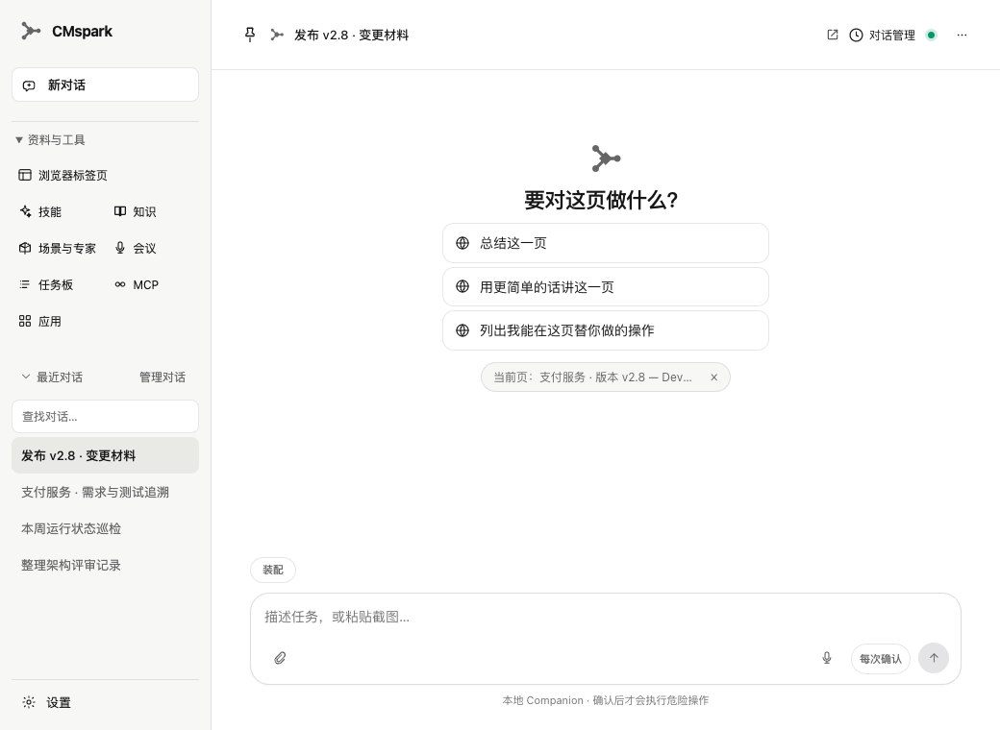
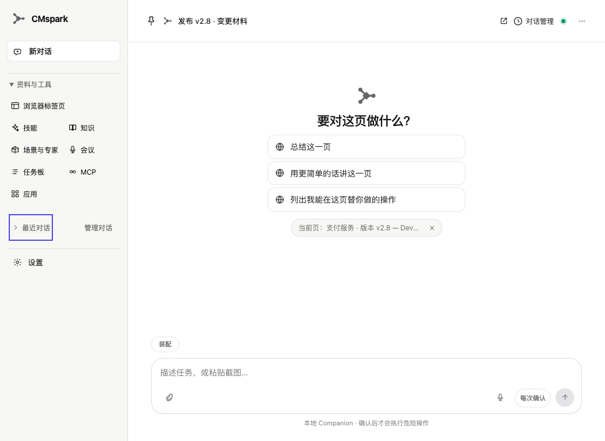
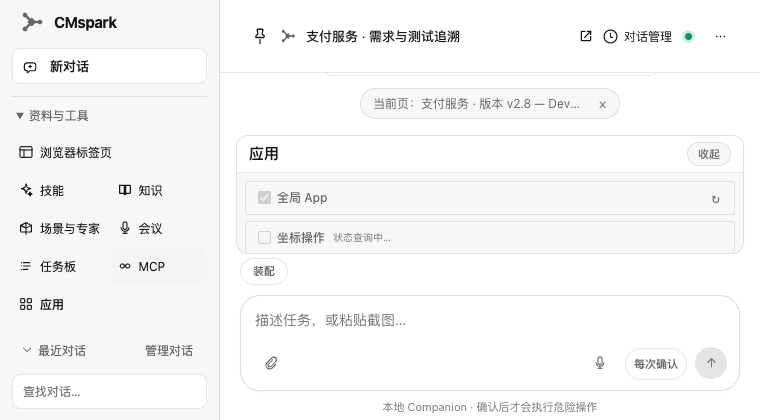
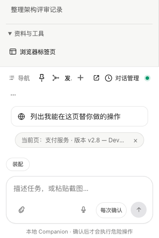

# #497 — wide sidebar disclosures

Issue: [#497](https://github.com/nehcuh/cmspark/issues/497). Design contract: root `DESIGN.md`, Information architecture.
Review baseline: `719890f4f160aef9b62b83d7eafa72e5a7b5dae8`.

Wide navigation now places resources above recent conversations and opens them by default. Recent conversations have an independent disclosure; its filter and rows hide together while new conversation and management remain available. The filter and active selection survive collapse. Browser tabs use a full row so the complete label remains visible. All eight existing resources use the same panel handlers. Narrow navigation retains conversation-first order and initially closed resources.

The disclosure state is local presentation state, not a second thread cache or a persisted preference. Crossing the responsive breakpoint remounts navigation with the appropriate defaults. This change does not claim to alter the native summoner, manage additional MCP/skills capabilities, or change any confirmation/transport behavior.

## Capability and gates

T2: Chrome extension navigation. Existing resources and ThreadList composition; no new L2 class, autonomy, trust, channel, or dependency. UI state does not grant execution authority.

| Check | Result | Evidence |
| --- | --- | --- |
| TypeScript | Exit 0 | `typecheck.log.gz` |
| Extension full suite | 1,339 pass; zero failures | `tests.log.gz` |
| Plasmo production build | Exit 0 | `build.log.gz` |
| Real App disclosure matrix | Seven viewport cases pass | `ui.log.gz` |
| Existing workspace UI regression | Pass, including confirmation/no-submit and coding ownership | `workspace.log.gz` |

Viewport matrix: 760×740, 1040×760, 1440×900, 760×420, 320×480, 390×740, 759×740. Coverage includes initial order/open state, Enter/Space, Tab focus, hidden filter/rows, retained query/selection, every resource button, management taxonomy/cleanup/graph, full browser label and horizontal overflow. The existing broad workspace regression's wide-resources precondition was updated to assert the new default-open state instead of clicking it closed. This is a test-only follow-up to the review packet; no production code changed after submission for review.

All tests use the production App with a synthetic runtime transport. They do not touch installed Chrome, user conversations or a live Companion. Native microphone/Windows desktop behavior is not claimed by this UI test.

```sh
source "$HOME/.nvm/nvm.sh"
nvm use 22
cd chrome-extension
npm test
npm run build
uv run --no-project --with playwright python scripts/test-sidebar-disclosures-ui.py
uv run --no-project --with playwright python scripts/test-workspace-ui.py
```

## Independent review

The review packet contains the real diff, complete changed components/styles, the synthetic transport fixture, disclosure test, design contract and machine results. Grok 4.6 and DeepSeek V4 Pro review independently; their reports and final status are retained with the packet. Informational commentary expressly described as non-defects is not converted into implementation changes.

## Rendered evidence

The implementer inspected the actual Chrome screenshots. The initially truncated browser label was fixed before the final review and screenshot capture.






## Trace case

1. Open wide navigation, filter conversations, collapse by keyboard, then expand and open existing resource/management panels.
2. Resources remain discoverable; collapsed rows leave the focus order while filter text, current selection and management survive.
3. Attribution: product navigation improvement; no Windows runtime claim.
4. Protected capability: discoverable resources and complete conversation management at wide and narrow sizes.
