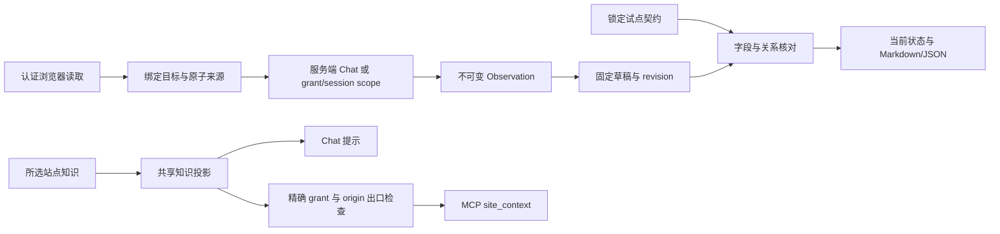

# 企业上下文与材料模块

0.7.0 的职责是把企业网页信息组织成可回溯、待人工复核的材料。两种 Mission 使用既有聊天执行链；MCP 只是获准使用外部助手时的可选入口。产品运行时不依赖开发过程中的 Grok/DeepSeek 复审。

| 模块 | 单一职责 | 不承担的职责 |
| --- | --- | --- |
| Extension page-read / provenance | 同步正文和页面 URL 采样，浏览器生成不透明导航指纹 | 不授予持久证据 ID，不自行声明分页完整 |
| `site-context/` | 目标规范化、知识选择与预算投影 | 不决定执行权限，不导出整个内部 prompt |
| `business-evidence/store` | 规范化内容、服务端时间/ID、scope 隔离、容量和原子持久化 | 不相信调用者 ID，不修改既有 Observation |
| `pilot-contract` | 来源命名空间、环境、集合范围、时效、人工关系映射的锁定快照 | 不由模型改写，不把静态声明当通用遍历器 |
| `draft-repository` | 固定 schema、revision、原子更新与精确请求回放 | 不决定当前事实是否齐备 |
| `field-checker` / `checker` | 引用、完整 token、来源绑定、时效、关系及派生标准核对 | 不证明测试语义充分，不把名称相似视为身份相同 |
| `service` / `render` | 创建更新回执、重新核对读视图、转义的材料输出 | 不发布变更，不创建远端故事/测试/缺陷 |
| Chat executor / Mission Packs | 路由绑定 scope、沿用既有停止/计划/确认/工具白名单 | 不新增另一套工具循环，不从参数接收 scope 权限 |
| `outbound-mcp/context-*` | 独立知识许可、精确 grant/session、返回前再次核验、局部经验摘要 | 不读取 Chat 材料，不导出历史 Observation，不借用 sibling grant |

后续新增字段应先定义来源和核对条件，再进入固定 schema/契约/负例；新增网页结构应实现有版本的提取适配器并以真实页面验证，不能在业务 checker 中堆站点 selector。新增业务场景优先复用证据与草稿能力，通过 Pack 组织流程。新增外部动作必须走既有执行权限与确认链，材料齐备不授予操作权限。

当前限制和真实试点入口见 [企业试点](enterprise-pilot.md)；发布证据见 [验收台账](audit/0.7.0-20260907/release-acceptance.md)。未知分页、虚拟化、iframe 或来源关系仍是缺口；两场景的真实验收是发布前置条件。
