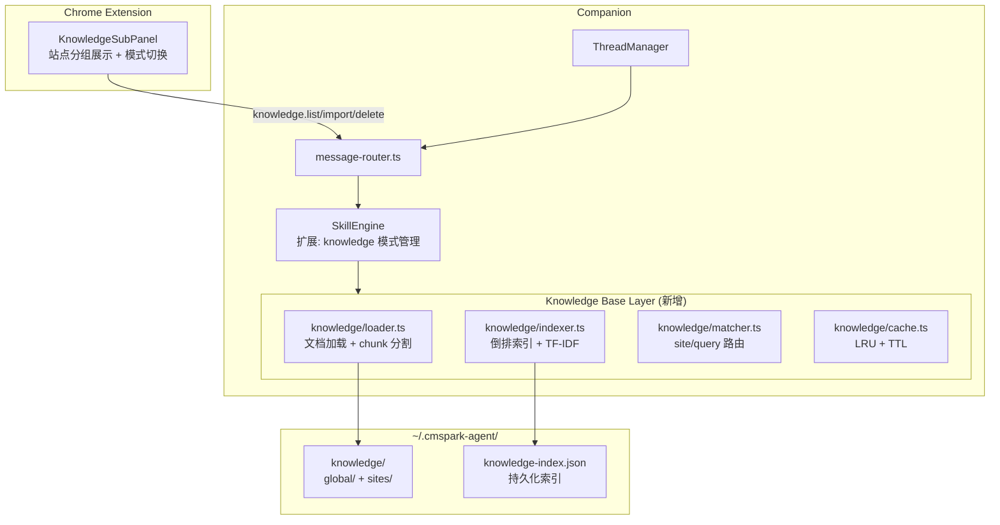

# CMspark 知识管理优化 — 折中方案

## 1. 架构图



## 2. 核心设计

### D1. 复用 SkillEngine 存储，引入独立索引层

知识文档与 Skill 同格式（Markdown + YAML frontmatter），但引入轻量级索引子系统：
- **倒排索引**：词项 → 文档列表，持久化为 `knowledge-index.json`
- **TF-IDF 向量**：复用 `semantic-match.ts` tokenizer
- **Chunk 分割**：按 Markdown H2/H3 切分，每 chunk ≤ 800 tokens

### D2. 知识选择三种模式

| 模式 | 行为 | 注入内容 |
|------|------|----------|
| `auto`（默认） | 站点匹配 + 语义匹配 | 匹配知识的摘要（~500 tokens） |
| `all` | 所有知识 metadata | compact index（name + description） |
| `manual` | 用户手动勾选 | 仅勾选的知识文档 |

`knowledge_selection_mode` 存储在 Thread 级，与 `skill_selection_mode` 独立。

### D3. 按需加载层级

```
1. Companion 启动：扫描 knowledge/，加载 metadata 到内存索引
2. buildSystemPrompt 时：
   a. auto: getBySite(hostname) + matchKnowledge(message) → Top 3
   b. all: 所有知识 compact index
   c. manual: 仅 active knowledge ids
   d. 按需读取 → sanitize → 截取摘要 → 注入
3. LLM 需要完整内容：调用 use_skill(name)（复用现有机制）
```

## 3. 模块改动点

### 新增文件（6 个）

| 文件 | 说明 |
|------|------|
| `companion/src/knowledge/types.ts` | KnowledgeDoc、KnowledgeChunk 类型 |
| `companion/src/knowledge/loader.ts` | 文档加载、Markdown chunk 分割 |
| `companion/src/knowledge/indexer.ts` | 倒排索引、TF-IDF、索引持久化 |
| `companion/src/knowledge/matcher.ts` | 站点匹配 + 语义匹配路由 |
| `companion/src/knowledge/cache.ts` | LRU 缓存（chunk + 查询结果） |
| `companion/src/knowledge/index.ts` | KnowledgeBase 主类 |

### 修改文件（9 个）

| 文件 | 改动 |
|------|------|
| `skill-engine.ts` | 注入 KnowledgeBase；扩展 buildSystemPrompt；新增 resolveKnowledgeIdsForThread |
| `thread-manager.ts` | 新增 `knowledge_selection_mode` 字段 |
| `message-router.ts` | 新增 `knowledge.*` 路由；chat.create 读取 knowledge mode |
| `llm/adapter.ts` | 接收 knowledge IDs 注入 system prompt |
| `server.ts` | 初始化 KnowledgeBase |
| `types.ts` (Extension) | 新增 `KnowledgeSelectionMode` |
| `agentStore.tsx` | 新增 `knowledgeSelectionMode` state 和 action |
| `KnowledgeSubPanel.tsx` | 模式切换 + 站点分组展示 |
| `background/index.ts` | 新增 `knowledge.*` 消息转发 |

## 4. 预估开发人天

| 模块 | 人天 |
|------|------|
| KnowledgeBase Core（types + loader + indexer + cache） | 2 |
| Knowledge Matcher + 主类 | 1 |
| SkillEngine 集成 | 1.5 |
| ThreadManager + MessageRouter + Server | 1 |
| LLM Adapter 集成 | 0.5 |
| Extension UI（KnowledgeSubPanel） | 1.5 |
| Extension Store + Background + Types | 0.5 |
| 测试 + 调优 | 1 |
| **总计** | **~9 人天** |

## 5. 潜在风险

| 风险 | 影响 | 缓解 |
|------|------|------|
| 索引文件膨胀 | `knowledge-index.json` 可能达数 MB | 索引分片、懒加载、未来迁移 SQLite |
| Context 窗口膨胀 | 注入过多知识片段 | 限制 auto 模式最多 3 个 chunk；chunk ≤ 800 tokens |
| 与 skills 概念混淆 | 用户分不清 skill 和 knowledge | UI 分区；模式命名区分 |
| 索引重建延迟 | 大量文档时首次重建耗时 | 异步后台重建、增量更新 |
| 未来向量数据库迁移 | TF-IDF 无法满足语义搜索 | 抽象 `KnowledgeIndex` 接口，未来可替换 |
