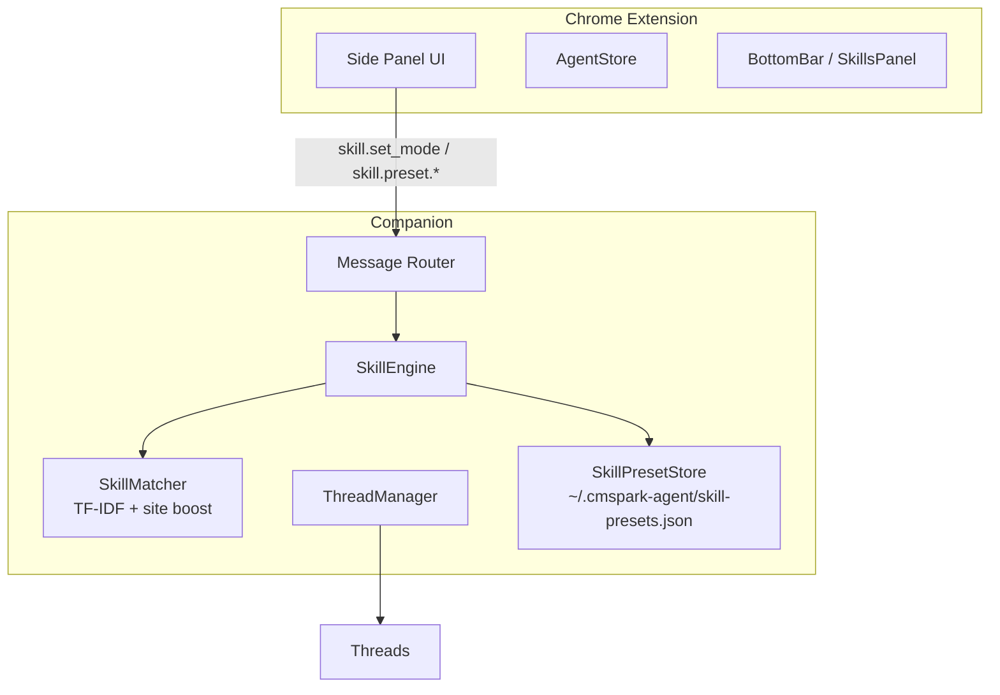

# CMspark 技能管理优化 — 折中方案

## 1. 架构图



## 2. 数据模型扩展

### Thread 模型
```typescript
interface Thread {
  // ... existing ...
  active_skill_ids: string[]
  skill_mode: "auto" | "all" | "manual"   // 默认 "auto"
  skill_preset_id?: string | null
}
```

### Extension State
```typescript
interface AgentState {
  skillMode: "auto" | "all" | "manual"
  skillPresets: SkillPreset[]
  currentPresetId: string | null
}
```

## 3. 核心逻辑

### 三种模式

```
resolveActiveSkills(threadId, message?, hostname?) → string[]

auto (默认):
  1. active_skill_ids + matchSkills(message) top 3 + getBySite(hostname)
  2. 合并去重，返回

all:
  返回所有技能的 name[]（排除不匹配当前站点的 site_knowledge）

manual:
  1. 如果有 skill_preset_id，加载预设的 skill_ids
  2. 否则返回 thread.active_skill_ids
```

### 增强版 matchSkills
- Site boost: skill.site 匹配当前 hostname，confidence + 30
- Tag boost: message 包含 skill.tags 中的词，confidence + 15
- 返回 top 5（扩展数量），添加 reason 字段用于 UI 展示

### SkillPreset 预设机制
存储位置：`~/.cmspark-agent/skill-presets.json`
API: `skill.preset.create/update/delete/list/apply`

## 4. 模块改动点

### Companion 侧

| 文件 | 改动 |
|------|------|
| `companion/src/threads/thread-manager.ts` | 加字段，兼容旧数据 |
| `companion/src/skills/skill-engine.ts` | 新增 `resolveActiveSkills()`、`matchSkills` 增强、preset 读写 |
| `companion/src/skills/semantic-match.ts` | 可选 siteBoost 参数 |
| `companion/src/message-router.ts` | 新增 `skill.set_mode`、`skill.preset.*` 路由 |
| `companion/src/llm/adapter.ts` | 接收 `resolvedSkillIds` |

### Extension 侧

| 文件 | 改动 |
|------|------|
| `chrome-extension/src/sidepanel/types.ts` | 新增 `SkillPreset`、`SkillMode` |
| `chrome-extension/src/sidepanel/store/agentStore.tsx` | 新增 state 和 actions |
| `chrome-extension/src/sidepanel/components/BottomBar.tsx` | 模式切换 + 站点分组 + 预设管理 UI |
| `chrome-extension/src/background/index.ts` | 新消息类型透传 |

## 5. 预估开发人天

| 模块 | 人天 |
|------|------|
| Thread 模型扩展 | 0.5 |
| SkillEngine 重构 | 2 |
| Message Router | 1 |
| Extension State | 0.5 |
| SkillsPanel 重构 | 2 |
| Background 透传 | 0.5 |
| 联调测试 | 1 |
| **总计** | **~8 人天** |

## 6. 潜在风险

| 风险 | 影响 | 缓解 |
|------|------|------|
| Auto 模式技能过多导致 token 溢出 | 高 | 限制返回最多 5 个；site_knowledge 走摘要注入 |
| All 模式 prompt 过长 | 高 | 排除 site_knowledge；限制 10 个技能 |
| Preset 与手动勾选冲突 | 中 | 应用 preset 后更新 active_skill_ids |
| matchSkills 增强后误匹配 | 中 | 保留 confidence 阈值；site boost 有上限 |
