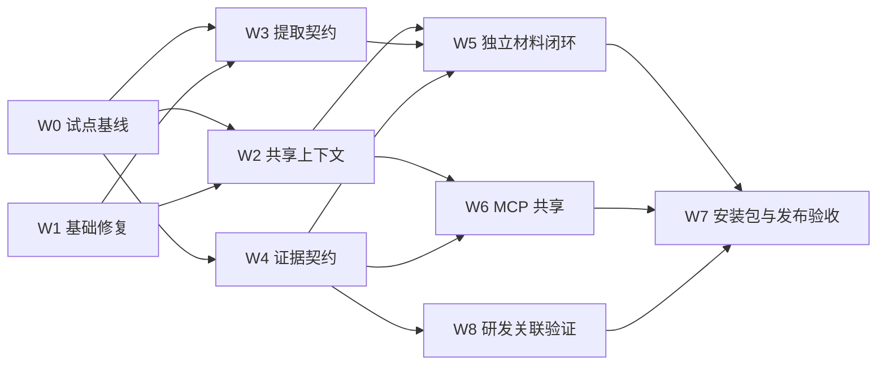

# CMspark 0.7.0 升级规划：企业跨系统材料闭环

GitHub: [#445](https://github.com/nehcuh/cmspark/issues/445)
日期：2026-09-07；基线：`63b449d9` / `0.6.6`
状态：2026-09-07 已获用户授权实施；W1 基础修复已完成机器检查与 Grok/Claude 独立复审并本地提交；W2 开始通用契约实现，核心设计 R4 待复审；未发布。
证据：[现状审计](../../audit/cmspark-0.7.0-readiness-2026-09-07.md)

## 1. 版本目标与范围

**产品句：**不需要 Codex，用户也能让 CMspark 从已登录企业网页获取、关联、核对变更材料；允许使用外部助手时，可受控复用同一套站点上下文和执行能力。

### 0.7.0 必须做到

- 独立模式：在明确支持的 OS 和企业模型上完成一个真实跨系统材料场景。
- 站点上下文随实际任务目标更新，不固定在发消息时的页面。
- 采集范围可知，材料关键字段有来源；缺失、冲突、过期与未知结果不能静默转成已完成。
- 用一个 Mission Pack 承载首业务场景，复用现有运行、授权、停止和装配机制。
- 在获准外部助手环境，通过独立授权的 MCP 上下文出口共享选定站点经验；不默认分享整个知识库。
- 旧配置、知识、线程、现有 MCP profiles 可升级；新旧边界能解释、可回滚。
- 修复审计确认的基础缺陷与测试隔离问题，取得本轮版本候选的完整机器结果和包体验收。

### 已确认首发场景

“变更申请材料准备”：DevOps 发布/构建信息＋制品身份＋架构依赖＋CMDB 运行态 → 带引用的材料草稿与核对表。四类信息可在试点具体系统中映射，不能在没有样本时假定页面/API/字段格式。

用户于 2026-09-07 明确确认两个场景都作为首发必验：变更材料草稿，以及研发需求—故事—代码—测试关联。OS、模型 endpoint 和样本可用性仍待补充。两条场景共享核心，分别提供材料与关联交付物及验收证据。

### 首发不捆绑

- 自动执行真实发布/运维变更。
- 自动创建变更单以及多个业务平台的事务一致性。
- 自动生成并提交全部故事/缺陷/用例、完整自主编码。
- CU/VLM 摘实验帽、更多会议功能、图谱重做、内嵌 IDE。
- 通用企业知识图谱、微服务化、工作流 DSL 新执行器、全库数据库迁移。
- 无需求依据的管理员平台、SSO/IAM 重建、集中部署控制台。

已有功能保留兼容与必要 bugfix；不为聚焦而删除它们。

## 2. 能力声明与现有 ADR 对账

```text
Surface: 现有 L0/L1；复用侧栏、Capture、确认台；不新增 L2 工具类
Composition: SiteContext / Evidence 服务化；Mission Pack 交付场景；MCP 可选入口
Autonomy: 复用现有单线程/Loop；首场景不要求多 Agent/无人值守
Trust: 不放宽现有准入；新增知识出口独立授权；业务验证不授予执行权限
Channel: Extension ↔ Companion 及 MCP；不新增公共监听面作为默认依赖
```

| 既有约束 | 0.7.0 处理 |
|---|---|
| ADR-020 单一内置 tool-loop | 保留；外部助手不是新增内置 runtime |
| ADR-014 场景 Pack-first | 首场景用 Pack；业务事实能力进入共享服务，不让 Pack 自写执行器 |
| ADR-016 Board 归 Autonomy | 单人材料不必开 Board；公共证据供 Board 引用，不把 Board 变成所有任务的总线 |
| ADR-022 default profile / grants | 不借新版本偷偷扩默认八工具或复用 ws_secret；新知识出口另定义受控 profile/授权 |
| #410 interact 已批准 | 保留已实现范围，明确其对旧冻结文本的有限修订 |
| ADR-025 编程接力 | 复用任务包；不以另加 App Server/PTY 工作台作为本版本前置 |
| ADR-026 TF-IDF / no embedding | 先测企业语料，再决定是否另立检索变更；本版本默认不换算法 |
| #328 execution_contract shadow | 保持其安全研究边界；业务核对不借它绕过安全门 |
| overlay 永不审批 | 保持；材料复核与高危执行审批不是同一概念 |

`capability_profile=enterprise` 是工具权限配置，不是所有企业用户的产品运行模式。核心材料采集使用 L1 即可，不要求三旗巡航、shell 或 netsec。

## 3. 实施工作包与依赖

| 工作包 | 内容 | 大小估计 | 依赖 | Blast | 发布地位 |
|---|---|---|---|---|---|
| W0 | 试点契约、能力台账、证据基线 | S/M | 无 | T0；真实操作另按行为 | 必须 |
| W1 | 测试隔离与三项确认缺陷修复 | M | 无，可与 W0 并行 | T1；实时授权依赖修改 T3 | 必须 |
| W2 | 共享站点上下文与经验生命周期 | L | W0 样本、W1 | T2；触及导出/权限则 T3 | 必须 |
| W3 | 有范围和覆盖状态的读取契约 | M/L | W0 页面、W1 | T2；边界变动 T3 | 必须，限试点结构 |
| W4 | 最小证据与材料核对契约 | L | W0 字段、W1；与 W2/W3 并行设计 | T2 | 必须 |
| W5 | 变更材料 Pack 与独立用户体验 | M | W2/W3/W4 | T2 | 必须 |
| W6 | MCP 站点上下文共享与双入口一致性 | M/L | W2/W4，独立授权设计 | T3 | 0.7.0 双入口承诺必须 |
| W7 | 企业模型、安装包、迁移与集成验收 | M/L | 从 W0 启动，最终依赖 W1–W6 | T1–T3；发布声明 T4 | 必须 |
| W8 | 研发需求—故事—代码—测试关联场景 | M/L | W2/W3/W4；与 W5 共享核心 | T2；写入沿用确认边界 | 首发必须，独立验收 |

S/M/L 仅表示相对体量，不是工期承诺。W2/W4 具有主要设计风险；W3/W7 取决于真实页面和企业环境。样本未到位时给确定发布日期会掩盖关键路径。

建议里程碑：



W8 已由用户明确升级为首发必验，成为 W7 收口依赖。不能用变更场景通过替代研发场景验收；未拿到真实页面/脱敏样本时只能报告合成验证结果。

## 4. 每个工作包的完成定义

### W0：先固定业务与评测分母

交付：

1. 当前能力台账：Issue/ADR、代码入口、测试、真人证据、状态、适用平台/模型、下一步。
2. 试点系统清单、只读测试账户/可访问范围、变更草稿模板、必需字段、允许缺失项。
3. 从真实页面脱敏得到开发回放材料；另留不用于开发调优的验收集。不得将内网正文上传公开 GitHub。
4. 两类用户路径：无 Codex 的独立使用；获准外部助手的 MCP 使用。
5. 基线测量：字段正确/缺失、错关联、冲突发现、人工修正时间、调用/重试次数。

必须先回答：目标 OS；企业模型及协议；扩展安装是否允许；系统身份与环境如何区分；架构材料是文本、表格还是图像；是否真的要求写入。图像材料没有可用视觉服务时，应支持明确缺失/人工补入，不能默认调用公网视觉。

验收：每项业务成功判据都有独立于模型叙述的检查方式；不得把“能连上 API”当作“目标模型可完成工具任务”。

### W1：先使缺陷和测试环境可控

拆为独立小 PR：

- W1a 测试进程/子进程数据目录统一隔离；修复 crash-handlers 和 npm-prefix 固定路径假设。增加“测试前后外部用户配置不变”的保护，测试不依赖开发者机器配置。
- W1b CU 当前策略提供器显式注入；生产保留既定实时撤销语义，测试可固定严格/巡航/无人值守条件。不能简单快照化 getConfig 来换取全绿。
- W1c get_page_html selector 在 CDP、ISOLATED、MAIN、DOM 回退语义一致；局部不存在时不升级成整页成功。
- W1d 站点经验 ID 无碰撞；旧 slug 保留兼容读取/迁移，冲突/手工文档同名不静默覆盖。

涉及文件：`companion/scripts/run-tests.mjs`、相关测试 setup、`computer/executor.ts`、`browser-bridge.ts`、`llm/adapter.ts`、`skills/skill-engine.ts`。

验收：原始反例先失败、修复后通过；相同 fake 输入不受机器配置影响；按严格/巡航/执行中撤销矩阵检查；完整 companion/extension suites 都实际执行完成，不能遗漏串行 settings-web 批次。

### W2：站点上下文和经验成为公共能力

候选接口：`resolveSiteContext({task, target, selection, consumer})`，返回带来源/版本/适用性/预算的快照。名字是讨论用，正式 spec 再固定 wire。

实施顺序：

1. 提取现有装配逻辑，不改变当前默认检索排序与预算。
2. 以服务端真实 tab URL 为目标，明确起始/导航/切 tab 刷新，处理查询与执行之间的页面变化。
3. 按试点需要支持 origin＋路径/页面类型区分；访问权限与知识命中规则分开。
4. 将经验 hydrate/失败计数/持久化编排从 adapter 移到共享执行边界；内置与 MCP 使用共同逻辑。MCP 的短期状态由服务器确定 caller/session/run 作用域、持续时间与清理规则：不能所有调用共享一个伪线程，也不能每次调用清零计数。不同任务不互相污染；只有经过明确验证的长期经验可跨 run 共享。
5. 经验增加可失效/复核规则，当前 run 能撤销已失效 ban；短期失败不自动永久封站。

验收：A→B→A、两个 tab 不同站点、同域不同应用、知识更新、过期经验、断连/重连。相同任务、目标、知识版本和授权知识集合时两入口结果一致；MCP 可是内置结果的授权子集并说明省略原因。两个并发客户端在同站不同任务的短期状态隔离；失效经验不能悄悄继续禁用有效操作。

### W3：先知道抓到了多少、来自哪里

新增/扩展读取结果必须至少包含实际目标、采集时间、提取范围、读取方式、覆盖状态、截断/停止原因；不支持的结构返回 unknown/partial，不能默认为完整。

按真实样本补：frame 选择、分页/虚拟列表、局部 selector 唯一性/歧义提示。不是一次实现所有网站，优先用站点操作知识和现有工具完成明确的分页流程。

采集结果中的 URL/时间/frame/outcome 由执行侧记录；页面声称的“共 N 条”保留为页面数据，不能伪装为外部真值。快照应记录是原始/清洗后/截断内容，摘要不能冒充原文。

验收：顶层/目标 iframe/局部 selector、第一页与完整分页、虚拟列表未滚完、目标不存在、重定向、权限失败、网络中断、超长页面。任务可以产生部分材料，但必须准确显示缺口。

### W4：证据、关联与业务完整性

在现有 ToolResult/Thread/Board 基础上提取最小公共证据类型。单人任务不要求 Board；协作时 Board 引用证据。

最小数据关系：

```text
实际工具结果 → Observation（来源/时间/范围/outcome/content ref）
Observation → 字段/Claim（关联键/字段引用/观察或推断/缺失冲突）
Claims + 场景必需材料 → Deliverable（草稿/待复核/验证结果）
```

必须区分：记录存在、调用成功、字段从结果提取、跨系统关系通过规则核对、人工确认。失败结果可证明失败，不能为任意成功声明升格。旧 tool_verified 数据迁移时不得无依据升级为新业务 verified。

变更试点只实现必要关联：系统标识、环境、release/build、artifact digest、架构版本/有效时间、CMDB 时间。无法唯一对应时给候选/冲突，不能用名称相似度自动确认。

业务状态与 RunProgress/Loop 分离：执行 tick 不等于目标达成；完整草稿需要场景要求全部有明确状态，存在阻断缺失/冲突时为待复核/部分。通用 Board 的协作收口不等于每个业务流程完成。

持久化需覆盖：重启恢复、原始消息压缩后引用可用、容量上限、清理、损坏/失踪引用、版本迁移。先采用最小存储适配，不顺带迁移全库。

验收：失败/无关工具 ID、伪造 quote、同名不同环境、错误制品 digest、来源时间缺失、架构/CMDB 冲突、截断引用、必需资料没收齐。错误声明不得通过；报告中的关键事实均能回到证据。

### W5：一个完整的变更材料 Pack

新建独立的材料采集场景配方，复用 expert-ops 文档模板有用部分。不要静默扩大现有只读顾问 Pack 的权限。

用户路径：选择场景 → 给系统/环境/版本 → 确认必要上下文 → 按站点采集 → 材料表与冲突/缺失 → 草稿预览/复制或获准导出 → 人工复核。

界面先复用聊天中的结构化卡片/引用/现有导出，不要求新增大型工作台。提示用户填关键业务信息即可，不把 L0/L1、tool_call_id、profile 等内部概念放入业务流程。

验收：没有 Codex、没有开启 shell/CU、只配置获准企业模型即可完成正常样本；部分失败时保留已采集材料和后续补齐入口；停止后不自动续跑；草稿不伪称已提交申请。

### W6：让 MCP 接入获得站点经验，而不仅是点击工具

第一步只做小范围上下文共享和证据返回，暂不暴露完整自主业务执行 Agent。

- 新上下文出口单独定义 tool/resource 及 profile/授权语义，不自动加入 default/interact，不把 allow_page_export 等同于全知识库外发许可。
- 返回明确选定、适用于当前站点/任务、允许分享的上下文；限制大小、保留来源/版本/数据性质。
- 请求目标由真实 tab 状态复核；grant 撤销、换 key、跨站导航、未连接扩展等继续正确拒绝。
- 现有页面读取/点击工具和错误兼容；新客户端能力不可用时解释限制，不默默退回全量知识外发。
- 内置与 MCP 的经验持久化/失效规则一致；短期状态按服务器确认的 caller/session/run 隔离，撤销/重连有明确延续或清理语义；caller 不得伪造可信记录或授权。

是否扩充全部 grant 的 per-site 字段需在正式 spec 中裁决：若用户承诺“只准某几个业务系统”，它就是发布门；否则不得展示这样的虚假隔离承诺。新增知识共享本身必须有足够窄的显式授权，不能因为全站 grant 暂缓而开放所有知识。

验收：相同任务/站点/知识版本及授权知识集合，两入口取得同一内容与来源；MCP 可以只取得授权子集，须说明省略原因。未授权知识、其他站点文档、已撤销 key 均不能外发；并发客户端与撤销重连不混用短期经验。外部模型是否遵循知识还需真实任务评估，服务返回一致不等于任务表现一定一致。

### W7：企业模型、包体、迁移与发布

前半从 W0 即开始，避免源码全部完成后才发现企业安装/模型不可用。

核心安装验收：

1. 指定目标 OS、浏览器和企业模型；无 Codex、无开发工具的干净用户环境。
2. 仅使用试点获准 endpoint 与依赖完成核心 L1 场景；请求出口实测覆盖主模型、标题、压缩、知识 AI 辅助、可选视觉等分支。若试点要求隔离公网，再增加断网验收；不能从“不可用 Codex”推定“全网隔离”。
3. 不可用视觉/语音/本地模型明确降级；核心任务不偷偷换公网 provider。
4. 实际最终安装包执行，不仅 staging：扩展配对、首次配置、重启、浏览器断连恢复、来源引用、停止。
5. 数据流说明准确：本地持久化脱敏与发给模型的内容是两个边界。是否要求更严格出口锁由企业部署要求决定。

升级与兼容：

- 使用脱敏/合成的 0.6.6 用户目录回放配置、知识、Skill/Knowledge 旧选择、经验 ID、线程、Board、grants、Pack snapshot、配对。
- 旧证据保持原语义，新字段 additive；不可读/冲突有明确状态，不丢原文、不静默过度信任。
- 新扩展/旧 Companion、旧扩展/新 Companion、MCP 旧 profile 均定义兼容行为；必要时 feature negotiation，不能只靠版本号猜支持。
- 迁移前可恢复备份；回退测试说明旧版本能否读新数据，必要时恢复备份，而非承诺无条件双向兼容。

版本动作只在候选通过后做：

- 同步 companion/package.json、companion/package-lock.json、chrome-extension/package.json 及实际使用的扩展 lockfile、AGENTS.md、installer.nsi fallback。
- 根 package.json 是 private wrapper，不应无理由加产品版本。
- 以 scripts/tests/test-package-gates.sh 的版本锚为准；PRODUCT/架构当前状态与 CHANGELOG 同步。
- 类型检查、完整测试、包体门、平台构建/实际 smoke。首发承诺的平台必须做完整真实场景与升级验收；其中 macOS 验最终 DMG 内签名/链接，Windows 验实际安装包及配对。非首发平台保留已有兼容/构建检查，明确尚未完成业务实测，不能将单平台试点悄悄扩大为全平台交付。
- tagged CI/release 产物、校验信息、升级/回滚说明；未验平台标明支持边界。
- 根据实际修改的 T2/T3/T4 分别完成独立对抗→Pi→必要真人验收，不用本分析代替发布 gate。

### W8：研发关联场景（首发必验）

使用独立于变更场景的验收集。选择一个真实需求页面，输出需求 ID、故事草稿、验收标准、测试/缺陷草稿与 commit/PR 链接引用。平台写入先不要求自动化；代码链接可由用户提供或从获准本地渠道读取。

独立用户可在原编辑器开发并回填链接；外部编码助手可使用现有 coding-handoff 任务包或 MCP。无需再实现完整 IDE，也不把 ACP 成功回传等同于平台关联已完成。

验收：在独立运行模式完成需求采集、故事/测试/缺陷草稿、代码引用与关联核对；正常关联以及错误需求 ID、缺少验收标准、无关代码链接、未覆盖测试均需独立真值验证。两条场景共用 Observation/Claim/Deliverable 类型与引用机制；若必须绕开共享证据系统，返回 W4 调整边界。此场景是发布门槛，但不对外宣称完整研发流程自动化。

## 5. 业务验收矩阵与指标

| 用例族 | 必须观察到的行为 |
|---|---|
| 正常四源材料 | 系统/环境/版本一致，字段有来源与时间 |
| 相似名称、prod/test | 不静默关联，明确冲突或要求选择 |
| 错制品/错构建 | 摘录保留，关联核对不通过 |
| 过期架构/CMDB | 采集时间与原数据时间分开，时效未知不假装新鲜 |
| 跨站/跨 tab/同域路径 | 目标知识及时更新，不残留错误站点规则 |
| iframe/分页/虚拟列表 | 实际范围/覆盖状态可见，不把一页当全量 |
| 权限/登录/网络失败 | 状态准确，保留已采集部分，不猜事实 |
| 网页或知识注入文字 | 作为数据处理，不能变更授权/升级为安全指令 |
| 失败/无关证据 ID | 不能使成功声明或完整材料通过 |
| 中断与恢复 | 停止有效，引用仍可解析，恢复不重复无意义操作 |
| MCP 未授权/撤销/变更目标 | 不导出不应共享的上下文/内容 |
| 安装包升级/降级 | 数据不静默丢失，能力/版本不匹配明确 |

若以后把自动创建变更单纳入范围，另加：用户明确确认→写入→远端 ID→回读字段；提交响应丢失时先查已创建记录，不直接重复提交。业务验证通过不能减免审批。

指标定义：

- 关键字段正确率：与锁定真值一致的已填写关键字段 / 已填写关键字段；另报覆盖率，不能通过不填提高准确率。
- 需求覆盖：已收齐且核对的必需材料 / 必需材料；阻断缺失和非阻断缺失分开。
- 冲突/缺失检出：已知异常是否被正确标记，同时统计正常材料误报。
- 引用可解析：草稿字段能定位 Observation 内容；不能仅有一个任意 URL。
- 人工修正时间：同一任务与人工基线比较，区分采集等待、模型等待、修正。
- 轨迹：无意义重试、错误站点知识命中、断连恢复、停止后续跑、若有写入则重复记录数。

在验收开始前锁定模型/应用/知识版本、样本与阈值；阈值依据 pilot 基线和业务风险，不在此虚构数字。锁定验收集中关键错环境静默通过、无证据完成、未授权导出必须为零。开发 fixture 全绿不代表真实系统通过。

## 6. 发版判定与当前差距

| Gate | 通过条件 | 当前状态 |
|---|---|---|
| G0 试点契约 | OS/企业模型/页面样本/字段与真值确定 | 待用户/企业环境输入 |
| G1 基础正确性 | F01–F03 修复、反例回归、全套隔离测试通过 | W1 实现/复审中，机器检查已有通过记录，尚未收口 |
| G2 站点能力 | 动态上下文、生命周期、两入口执行经验一致 | 当前存在断层 |
| G3 业务证据 | 有范围、有来源、字段对应、缺失冲突正确 | 当前契约不足 |
| G4 独立闭环 | 无 Codex 的真实企业模型分别完成变更材料与研发关联任务 | 两场景均未验证 |
| G5 受控 MCP | 选定知识/证据共享与撤销/范围/兼容通过 | 基础 MCP 已有；新共享未实现 |
| G6 包体与升级 | 实际支持平台安装、出口、0.6.6 迁移/回退 | 本轮未做 |
| G7 发布审查 | 新鲜机器结果、独立对抗→Pi、必要真人证据 | 本分析不构成放行 |

**今天的判定：可进入 0.7.0 实施准备，不能发布 0.7.0。** 优先启动 W0/W1，然后让 W2/W3/W4 汇合为 W5；不继续用外围功能数量稀释版本目标。

## 7. 当前待确定事项

- 首发场景已确认两个都必须验收；需补齐两条场景各自的页面样本、字段真值和验收数据。
- 首个支持 OS/浏览器、企业允许的模型及协议、扩展安装方式。
- 可提供哪些脱敏页面/历史任务真值，谁做真实环境复核。
- 0.7.0 是否必须自动写入平台；本规划默认草稿交付。
- 是否要求按系统限制每个外部 caller，或只允许企业内部 MCP 客户端；这决定 per-site grant 和知识出口的具体契约。

这些事项影响正式 spec 与排期，但不阻止先修测试隔离、HTML 范围和经验身份等已确认问题。


## 实施进度（2026-09-07）

- 分支：`codex/0.7.0-enterprise-workflows`，基线 `63b449d9`。
- W1：测试隔离、实时巡航策略依赖、局部 HTML 读取回退、站点经验标识正在实现与复审；不提前宣称通过门禁。
- 每个重要节点使用 Grok + Claude 两个独立 CLI 会话；严格要求明确结论，失败或缺失结论不能算通过。
- W8 已升级为独立首发验收场景。完整字段与写入边界随试点样本确定，仍不承诺自动完成全部编码或不经确认的跨系统提交。
