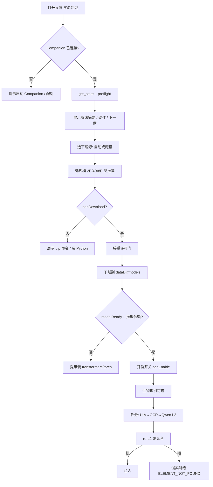

# 产品设计方案：Qwen3-VL 实验定位层（TinyClick 替换）

> **状态**：**PASS_WITH_CHANGES** — 设计可作为开工权威；**实现 P0（§16.2 A1–A8）未完成前不得宣称可内测**  
> **日期**：2026-08-01  
> **范围**：Computer Use L2 实验层 — 本机视觉 GUI 定位  
> **开工入口**：[实施 plan](../plans/2026-08-01-qwen3-vl-experimental-layer-impl.md) · [交接 HANDOFF](../plans/2026-08-01-qwen3-vl-HANDOFF.md)  
> **用户说明**：[qwen-vl-experimental-layer.md](../../qwen-vl-experimental-layer.md)  
> **规范坐标**：[ADR-017](../../adr/017-computer-use.md) · [ADR-020](../../adr/020-capability-model-three-axes.md)  
> **审查**：四路内部对抗 + Pi/Claude/Kimi 三路 → 见 [三路综合](../../audit/reviews/qwen3-vl-product-design-triple-synthesis-20260801-145529.md)

---

## 0. 一句话

把「可选、未校准、本机运行」的 **L2 视觉定位建议层** 从 TinyClick（ONNX、无可用发布链）换成 **Qwen3-VL（可下载、中文可用）**，并在 **Companion 权威** 下提供 **环境预检 → 国内可下 → 硬件推荐 → 显式启用 → 每点必确认** 的完整产品路径。

---

## 1. 问题陈述

### 1.1 旧方案失败点

| 问题 | 影响 |
|------|------|
| TinyClick manifest 使用 `models.cmspark.invalid` | 设置页「下载」零网络 fail-fast，用户感知为「没反应」 |
| 中文 golden ~13% | 无法作为中文桌面主路径 |
| ONNX 自托管 host 未定 | E2E 下载永远缺一环 |
| 无环境预检 / 无国内源 | 即使用 Qwen，大陆用户仍装不起来 |

### 1.2 用户真实目标（访谈/讨论收敛）

1. **能下**：中国大陆网络可完成权重获取（非仅海外 HF）。  
2. **能装清**：知道要装什么（Python/依赖），不是点了才炸。  
3. **能选规模**：2B 默认可跑；4B/8B 可选并标明内存/显存。  
4. **能启用**：下载后经 Companion 发现就绪态，显式开关启用（非静默）。  
5. **敢用**：命中只是建议，注入前人工确认；失败不拖垮 UIA/OCR。

### 1.3 非目标

- 替代 UIA/OCR 成为默认兜底（实验层永远可选、默关）。  
- 浏览器扩展内嵌推理 / 无 Companion 运行。  
- 自动开启 `modelEnabled`（违反 ADR-010 opt-in）。  
- 捆绑完整 PyTorch wheel 发行包（可作为后续发行工程，不在本方案 MVP）。  
- 承诺中文/全分辨率精度 SOTA（未校准；诚实披露）。

---

## 2. 能力坐标（ADR-020）

```text
Surface:      L2 Computer experimental locate only
              (L0 UIA / L1 OCR unchanged; no new Host surface)
L2-classes:   experimental_suggestion — re-L2 human gate always
Compose:      none (no Pack 关掉确认；无 Board 入口)
Autonomy:     single-thread task; no multi-worker
Trust:        modelEnabled + license door + biometric enable
              + per-hit re-L2; god-mode / auto_approve NEVER skip
Channel:      community (local download + local inference)
```

**叠加纪律**：本层只增加「建议点」；不得降低既有 L2 任务确认、急停、白名单、session-trust 排除 experimental 的规则。

---

## 3. 角色与权威边界

| 角色 | 职责 | 禁止 |
|------|------|------|
| **Chrome 扩展（Side Panel）** | UI：预检展示、源/规模选择、下载/启用按钮；转发 `computer.model.*` | 本地推理；静默改 Companion 配置；绕过 source:"settings" |
| **Companion** | 唯一权威：预检、下载、落盘、加载、admission、locate | 无用户 opt-in 写 modelEnabled=true |
| **Python worker** | 权重加载 + 单帧推理 | 网络下载（下载由单独脚本/hub 完成） |
| **用户** | 安装 Python/依赖、选择源与规模、接受许可、开启开关、确认建议点 | — |

**发现模型** = Companion `probe` 磁盘 + `get_state` 广播，**不是**扩展扫盘。

---

## 4. 用户旅程（SoT）

### 4.1 主路径（Happy path · 大陆）



### 4.2 状态机（产品态）

| 态 | 含义 | 主 CTA |
|----|------|--------|
| **S0 未连接** | WS 断开 | 连接 Companion |
| **S1 环境未齐** | 缺 Python/下载依赖 | 复制安装命令 |
| **S2 可下载** | canDownload ∧ ¬modelReady | 下载模型 |
| **S3 已下缺推理** | modelReady ∧ ¬推理依赖 | 安装 transformers/torch |
| **S4 可启用** | canEnable ∧ ¬modelEnabled | 开启（许可/生物识别） |
| **S5 已启用** | modelEnabled ∧ ready | 使用中；可关/可删 |
| **S6 熔断** | circuit open | 重置熔断 |
| **S7 许可拒绝** | declined 永久 | **设置页「重新考虑许可」复位**（D9；禁止仅手改 config） |

### 4.3 错误诚实面（必须映射到 UI 词表）

| reason | 用户看见 |
|--------|----------|
| `python-missing` | 缺 Python 3 + 安装指引 |
| `hf-hub-missing` | 缺 huggingface_hub；建议改魔搭 |
| `modelscope-missing` | 缺 modelscope；或改 HF 镜像 |
| `download-failed` | 网络/源失败；换源重试 |
| `disk-full` / 空间不足提示 | 清理磁盘（预检 freeDisk） |
| `model-not-ready` | 未下载或不完整 |
| `worker-spawn-failed` | 推理进程起不来（不崩 Companion） |
| coordinate 失败 | 层内 error，链继续 UIA/OCR 语义 |

---

## 5. 功能规格

### 5.1 模型目录

| 变体 | HF / ModelScope id | 磁盘目录 | 约体积 | 建议统一内存 | 建议独显 |
|------|-------------------|----------|--------|--------------|----------|
| **2b**（默认） | `Qwen/Qwen3-VL-2B-Instruct` | `~/.cmspark-agent/models/qwen3-vl-2b/` | ~4.5GB | ≥12GB | ≥6GB |
| **4b** | `Qwen/Qwen3-VL-4B-Instruct` | `.../qwen3-vl-4b/` | ~8GB | ≥20GB | ≥10GB |
| **8b** | `Qwen/Qwen3-VL-8B-Instruct` | `.../qwen3-vl-8b/` | ~16GB | ≥32GB | ≥16GB |

就绪判定（MVP）：目录存在 `config.json` + 体积统计；后续加固：至少一个 `*.safetensors`。

### 5.2 下载源

| 源 id | 行为 |
|-------|------|
| `auto` | 连通性探测 HF + ModelScope；`LANG` 含 zh 且魔搭可达 → modelscope；HF 不通魔搭通 → modelscope；否则 HF 或 hf-mirror 提示 |
| `modelscope` | `modelscope` snapshot_download |
| `hf-mirror` | `HF_ENDPOINT=https://hf-mirror.com`（或 config mirror） |
| `huggingface` | 官方 HF |

**明确不做**：IP 地理库定位（误判与隐私）；静默切换源且不告知用户（`downloadSourceReason` 必须展示）。

环境变量覆盖：

- `CMSPARK_MODEL_SOURCE=modelscope|huggingface|hf-mirror`
- `HF_ENDPOINT=...`

### 5.3 环境预检（preflight）

Companion 在 `get_state`（设置打开）时产出：

```ts
preflight: {
  deps: { python, huggingface_hub, modelscope, transformers, torch, pillow }
  hardware: { totalRamGb, freeRamGb, freeDiskGb, accelerator, vramGb, notes[] }
  recommendedVariant: "2b"|"4b"|"8b"
  variantFit: "ok"|"tight"|"insufficient"
  modelReady, canDownload, canEnable
  nextSteps: string[]      // 有序中文步骤
  installCommands: string[] // 可复制 pip
  downloadSourceResolved, downloadSourceReason
  readinessSummary: string
}
```

**硬件推荐算法（产品规则）**：

- 预算 = CUDA 时用 VRAM，否则 totalRam  
- ≥28GB → 可荐 8b；≥16 → 4b；否则 2b  
- fit：预算 ≥ 建议值 ok；≥70% tight；否则 insufficient（**不禁止下载**，只警告）

### 5.4 启用门禁

开启 `modelEnabled=true` 必须：

1. `modelLicenseDeclined !== true`  
2. 许可已接受（时间戳 + 文本哈希；条款变则重弹）  
3. 设置页 `source:"settings"`  
4. 生物识别/确认通道（与 apps 同级，若通道缺失则失败）  
5. **`canEnable` 为 false 时 UI 硬禁用开关，且服务端拒绝 `set_enabled(true)`（D1=A，P0）**

关闭：永远免费；dispose 会话。删除模型时：dispose + 清 `modelEnabled=false`（防「已开启+absent」假绿）。

### 5.5 运行时 locate

- 链序：**UIA → OCR → Qwen-VL → cloud stub**  
- 命中：`layer: "qwen-vl"`，`experimental: true`，无 confidence  
- 包线：空命令 / 过长 / 帧过宽 → skipped；坍缩检测保留  
- **允许中文**（相对 TinyClick 变更）  
- 坐标：图像像素空间；**禁止**在宽屏上把绝对像素误当 0–1000 相对（设计强制：见 §8 已知缺陷）  
- re-L2 文案：标明 Qwen3-VL、未校准、可能完全错误  
- session-trust：**不得**静默过 experimental  

### 5.6 依赖策略（MVP vs 目标）

| 层级 | MVP（当前方案） | 目标（后续发行） |
|------|-----------------|------------------|
| 运行时 | 用户系统 Python + pip | 捆绑 venv / uv 锁文件 |
| 下载 | hub 包 | 同左 + 断点续传进度字节化 |
| 推理 | transformers+torch | 可选 GGUF/llama.cpp 降依赖 |
| 安装 | 设置页复制命令 | 「一键安装依赖」经确认 shell |

---

## 6. 信息架构（设置页）

```
实验功能
├─ 标题：Qwen3-VL 本地视觉定位
├─ 开关：已开启 / 已关闭
├─ 使用步骤说明（Companion 权威）
├─ 就绪卡片（readinessSummary + 硬件一行）
├─ 下一步列表 nextSteps（≤6）
├─ 安装命令 monospaced
├─ 下载源 [自动|魔搭|HF镜像|HF]
├─ 规模 [2B 推荐?][4B][8B] + resourceTip
├─ 状态行（modelStatus / error 词表）
├─ 按钮 [下载][删除][重置熔断]
└─ 错误位 computerModelError
```

许可门：Modal 原文 `LICENSE_DOOR_TEXT`（Qwen 条款 + 未校准披露 + 体积/依赖诚实句）。

---

## 7. 协议与配置

### 7.1 WS（settings-only mutators）

| type | 字段 | 说明 |
|------|------|------|
| `computer.model.get_state` | — | 含 preflight |
| `computer.model.set_enabled` | enabled, source | 生物识别 |
| `computer.model.license_response` | accepted, source | 接受可触发下载 |
| `computer.model.download` | source | 按当前变体+解析源 |
| `computer.model.delete` | source | dispose+删目录 |
| `computer.model.set_variant` | variant, source | dispose 旧会话 |
| `computer.model.set_download_source` | downloadSource, source | auto/hf/… |
| `computer.model.reset_circuit_breaker` | source | |

广播：`computer.model.state` / `.progress` / `.license_required`；错误 `family:"computer.model"`。

### 7.2 config.json `computer.*`

| 字段 | 默认 | 说明 |
|------|------|------|
| `modelEnabled` | false | 实验层开关 |
| `modelVariant` | `"2b"` | 2b\|4b\|8b；legacy hybrid/int8→2b |
| `modelDownloadSource` | `"auto"` | 见 §5.2 |
| `modelMirror` | unset | HF 主机覆盖 / 镜像 origin |
| `modelDiskBudgetMB` | — | **D8：废除产品语义**；改用预检「可用磁盘 ≥ 变体+2GB」 |
| `modelLicenseAcceptedAt` / `TextHash` / `Declined` | — | 许可门 |

---

## 8. 安全与信任

### 8.1 威胁与控制

| 威胁 | 控制 |
|------|------|
| 未审建议点注入 | re-L2 + experimental_suggestion；session-trust 排除 |
| WS 注入下载/启用 | source:"settings" 双层 + 鉴权连接 |
| 恶意模型代码 | `trust_remote_code` 供应链风险：**须在许可门与 docs 明示**；长期应用 sha256 钉死或关闭 remote code |
| Python 缺失导致 Companion 崩溃 | runtime spawn `error` 监听，层内 fail-closed |
| 磁盘塞满 | preflight 磁盘提示 + **enforce budget** |
| 供应链劫持镜像 | 镜像可配；哈希钉死为 P1 加固 |

### 8.2 许可

- 门文案绑定 Qwen3-VL / HF·魔搭 许可「以模型卡为准」  
- 哈希绑定文案版本；变更重弹  
- 拒绝 = 永久跳过；**设置页「重新考虑许可」可复位**（D9）

---

## 9. 决策锁（四路对抗后 · 2026-08-01）

| ID | 问题 | **锁定** | 理由 |
|----|------|----------|------|
| **D1** | `canEnable=false` 时开关 | **A 硬禁用 + 服务端拒绝 `set_enabled(true)`** | 防假绿；安全/UX 两路均 Blocking |
| **D2** | insufficient 选 8B | **B 警告可下不可强开** | 下载警告；启用仍受 D1/canEnable |
| **D3** | 坐标协议 | **A 仅像素 JSON**；删除宽屏假 0–1000 分支；golden 必测 | 错坐标 + re-L2 = 安全事故 |
| **D4** | 一键 pip | **A 本版复制命令**；结构化 nextSteps + 展示 python 路径 | PEP 668 说明必须进文案 |
| **D5** | 捆绑 runtime | **A 本版不捆**；P3 再议 | SEA 仍须打包 worker.py |
| **D6** | TinyClick 代码 | **A 保留 unwired**；文案零 TinyClick；CI grep | 遗留命名仅内部 |
| **D7** | 进度 | **MVP=诚实 indeterminate**；P1=真字节 | 禁止假 0→100% |
| **D8**（新） | disk budget | **废除 `modelDiskBudgetMB` 产品语义**；预检 enforce **可用磁盘 ≥ 当前变体 downloadGb+2GB** 才 `canDownload` | 默认 2048MB 与 4.5GB+ 矛盾；三路要求「二选一」→ 选定本支 |
| **D9**（新） | 许可永久拒绝 | **设置页「重新考虑许可」**清 declined（须再过门） | 全文不得再写「仅手改 config」 |
| **D10**（新） | trust_remote_code | **P0 门文案 ACE + 评估是否可关 remote**；P1 revision+safetensors；能关则优先关 | 法务/安全 |
| **D11**（新） | session-trust × modelEnabled | **`modelEnabled===true` 时 G1 initial-skip 一律禁止**（不用横幅代替） | 安全；接线点写清：`g1InitialSkipEligible` 读 config |

---

## 10. 分阶段交付

> **权威分期以 §16.2 为准**（Pi/Claude/Kimi 三路：§10 不得与 §16 打架）。

### P0 — 未完成不得宣称「可内测 / 实验层 merge-ready」

等同 §16.2 **A1–A8**（坐标 / D1 硬禁用 / 去 TinyClick 文案 / 许可门 / worker 打包 / 磁盘 D8 / 下载态+indeterminate 进度 / G1×modelEnabled）。

### P1 — 可对内测用户（P0 全绿之后）

预检缓存与 python 路径贯通、权重文件就绪、换源重试与下载取消、D9 许可 UI 复位、THIRD_PARTY 补 Qwen、handlers 测试恢复、大陆 Python/torch 说明、§11 成功率本地枚举可测。

### P2 — 可公开实验

真字节进度、一键装依赖、revision/哈希、中文 golden、Companion 未连接引导。

### P3 — 发行体验

捆绑 venv、模型增量更新、遥测扩展（仍仅本地）。

---

## 11. 成功指标

| 指标 | 目标 |
|------|------|
| 大陆用户「从打开设置到权重落盘」成功率 | ≥70%（有 Python 基线的机器） |
| 预检后「不知道下一步」支持工单 | 下降（nextSteps 覆盖率 100% 主失败态） |
| L2 注入未经确认 | **0**（硬指标） |
| Companion 因缺 Python 崩溃 | **0** |
| 启用后 admission 失败且 UI 显示「已开启可用」 | **0** 假绿 |

---

## 12. 测试与验收

### 12.1 自动化

- Locator：空命令/中文/坍缩/包线  
- Handlers：set_variant、set_download_source、download fail reasons、license hash  
- Preflight：mock 硬件与 deps（无网络）  
- Locate-chain：layer `qwen-vl`、experimental 透传  
- Runtime：spawn fail → ModelRuntimeError 非进程退出  

### 12.2 手工清单

- [ ] 无 Python：预检 S1，下载禁用，Companion 存活  
- [ ] 仅 modelscope 包：源=魔搭可下  
- [ ] HF 不通：auto → 魔搭  
- [ ] 2B 下完 canEnable → 开 → 任务出 re-L2  
- [ ] 拒绝建议：无注入  
- [ ] 关开关：dispose，RSS 回落（best-effort）  

---

## 13. 文档矩阵

| 文档 | 读者 |
|------|------|
| 本规格 | 产品/研发/对抗 |
| `docs/qwen-vl-experimental-layer.md` | 用户 |
| `docs/computer-use-user-guide.md` §6.1 | 用户索引 |
| ADR 补记（可选 021） | 架构：Qwen 替换 TinyClick + 供应链 |

---

## 14. 已实现 vs 规格缺口（基线对照 2026-08-01）

| 项 | 代码基线 | 规格要求 |
|----|----------|----------|
| Qwen 替换 locate | ✅ | ✅ |
| 2b/4b/8b + UI | ✅ | ✅ |
| preflight + nextSteps | ✅ 部分 | ✅ 须稳定进 get_state |
| 下载源 auto/魔搭/镜像 | ✅ | ✅ |
| spawn 防崩 | ✅ 已补 | ✅ |
| 坐标启发式 | ⚠️ 有缺陷 | **P0 必修** |
| companion 文案仍 TinyClick 镜像 | ⚠️ | **P0 必修** |
| disk budget enforce | ❌ | P1 |
| 真进度字节 | ❌ | P1 |
| canEnable 硬禁用开关 | ⚠️ 下载禁用为主 | **D1=P0 必做** |
| 一键 pip | ❌ | P2 |
| Qwen THIRD_PARTY | ❌ | P1 |

---

## 15. 变更日志

| 日期 | 变更 |
|------|------|
| 2026-08-01 | 初稿：整合讨论 + 代码基线 + 待对抗 |
| 2026-08-01 | 四路对抗后：§9 决策锁死；§16 对抗并集与修订清单 |
| 2026-08-01 | Pi/Claude/Kimi 三路：APPROVE_WITH_CHANGES；消 §10/§16 打架；D8/D11 选定单一分支；S7/D9 对齐 |

---

## 16. 多路对抗纪要与修订清单

### 16.1 对抗阵容与裁决

| 通道 | 焦点 | 裁决 |
|------|------|------|
| **Security / Trust** | 注入、假绿、session-trust、供应链 | **FAIL**（设计未锁 D1/D3/remote-code） |
| **UX / 大陆网络** | 无 Python、HF 不可达、自动启用期望 | **PASS_WITH_CHANGES** |
| **Architecture / Runtime** | SEA 打包、坐标、双源文案、预算 | **PASS_WITH_CHANGES** |
| **Legal / Supply-chain** | 许可门、notices、魔搭完整性 | **PASS_WITH_CHANGES** |
| **综合** | 从严 | **PASS_WITH_CHANGES**（安全路 FAIL → 必须先改设计再标 P0 完成） |

全文归档：`docs/audit/reviews/qwen3-vl-product-design-adversary-synthesis-20260801.md`

### 16.2 遗漏并集（按优先级）

#### P0 — 设计已锁 / 实现必做（未完成不得宣称「可内测」）

| ID | 来源 | 要求 |
|----|------|------|
| A1 | Sec+Arch | **D3=像素坐标 only**；修 worker `_normalize`；宽屏 golden |
| A2 | Sec+UX | **D1=硬禁用**；`set_enabled(true)` 服务端校验 canEnable |
| A3 | Arch+UX | companion `MODEL_SWITCH_COPY` / 状态文案 **去 TinyClick** |
| A4 | Sec+Legal | 许可门：**trust_remote_code ACE** + SPDX/Apache + **落盘路径** + **实际下载源**（非写死 HF） |
| A5 | Arch | **打包 `qwen-vl-worker.py`**（SEA/DMG）；resolve 按 exists-walk + execPath |
| A6 | All | **disk budget**：删字段或「可用磁盘 ≥ 变体+2GB」enforce（废除 2048MB 默认谎言） |
| A7 | UX | 状态机补 **S_DOWNLOADING / S_PARTIAL**；进度 indeterminate 诚实 |
| A8 | Sec | **modelEnabled ⇒ 禁止 G1 session-trust initial-skip**（或强制任务横幅） |

#### P1 — 内测前强烈建议

| ID | 要求 |
|----|------|
| B1 | 就绪判定：`config.json` + **至少一个权重文件** |
| B2 | nextSteps **结构化**；展示 Companion **实际 python 路径**；PEP 668 文案 |
| B3 | auto 失败 **一键换源重试** |
| B4 | S7 **UI 复位许可拒绝**（D9） |
| B5 | THIRD_PARTY 补 Qwen；TinyClick 标 legacy |
| B6 | 恢复 handlers 互斥 / set_enabled 矩阵测试 |
| B7 | preflight 缓存；runtime 使用 preflight 的 pythonPath |
| B8 | torch 大陆安装折叠说明（用户文档） |
| B9 | 首屏固定句：**「不会自动开启」** |

#### P2 — 公开实验

| ID | 要求 |
|----|------|
| C1 | 真字节进度 / 续传语义 |
| C2 | 一键装依赖（确认 shell） |
| C3 | revision 钉死 + 哈希校验 |
| C4 | 中文 golden 小集 |
| C5 | Companion 未连接 deep-link 安装引导 |

### 16.3 状态机补丁（相对 §4.2）

| 态 | 含义 | CTA |
|----|------|-----|
| **S_DOWNLOADING** | 下载进行中 | 等待 /（P1）取消 |
| **S_PARTIAL** | 半成品目录 | 清理并重试 / 续传 |
| **S_VERIFYING** | 校验权重 | 等待 |

### 16.4 许可门规范清单（对抗后强制）

`LICENSE_DOOR_TEXT` 必须含：

1. 模型 id 列表 + **SPDX（如 Apache-2.0）以快照 LICENSE 为准**  
2. **trust_remote_code：将执行模型目录内自定义代码，权限同本机用户**  
3. 落盘路径模板 `~/.cmspark-agent/models/qwen3-vl-<variant>/`  
4. 下载源族：HF / ModelScope / 镜像（接受时以当前选择为准）  
5. 体积 + 内存/显存风险 + 未校准  
6. CMspark **不随包分发** torch/transformers（用户自装其许可）  
7. 默认关闭；每点 re-L2；拒绝可复位（D9）

### 16.5 修订后验收

- [ ] §9 决策已全部落地代码  
- [ ] 四路 Blocking A1–A8 关闭  
- [ ] 用户文档按「连接 Companion → 环境 → 源 → 下 → 推理依赖 → 手开」重写 §1–2  
- [ ] 对抗复扫：Security 路至少 PASS_WITH_CHANGES（无 FAIL）
